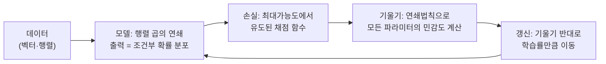

# 3장. 학습을 떠받치는 수학

> 이 장의 질문: **학습 기계를 만드는 데 수학이 정확히 어디에, 왜 필요한가?** 벡터·행렬, 미분, 확률 — 세 도구를 "필요한 만큼만, 그러나 진짜로 이해되게" 손에 넣는다.
>
> 전제: 2장. 이 장은 사전처럼 완결적이지 않다. 의도적으로 그렇다 — 도구는 쓰이는 맥락 안에서 배워야 남는다.

수학책의 순서가 아니라 우리 문제의 순서로 가자. 2장의 학습 기계를 현실 크기로 키우려면 세 가지가 막힌다. 입력이 숫자 하나가 아니라 수백만 개다(→ 벡터·행렬). 기울기를 구할 수식이 훨씬 복잡해진다(→ 미분과 연쇄법칙). 그리고 데이터와 예측에는 불확실성이 낀다(→ 확률). 하나씩 뚫는다.

## 1. 벡터와 행렬 — 많은 숫자를 하나처럼 다루기

집값 예제에서 입력은 평수 하나였다. 현실에서는 평수, 방 개수, 역까지 거리, 층수… 숫자 여러 개가 입력이다. 숫자들을 순서 있게 묶은 것이 **벡터**다.

$$
x = (24,\ 3,\ 0.8,\ 12)
$$

"24평, 방 3개, 역까지 0.8km, 12층"인 집 한 채가 4차원 벡터 하나다. **차원**이란 신비로운 말이 아니라 그저 "숫자가 몇 개 묶였는가"다. 사진 한 장은 픽셀 수만큼의 차원을 가진 벡터이고, 이 책 뒷부분에서 단어 하나는 수천 차원 벡터가 된다. **딥러닝의 제1 세계관: 세상 만물을 벡터로 바꿔서 다룬다.**

집값 모델은 이제 각 입력 항목마다 가중치를 하나씩 두어 이렇게 된다.

$$
\hat{y} = w_1 x_1 + w_2 x_2 + w_3 x_3 + w_4 x_4 + b = w \cdot x + b
$$

가중치들을 곱해서 더하는 저 연산 — 벡터끼리 항목별로 곱해 모두 더하는 것 — 이 **내적**($w \cdot x$)이다. 내적은 이 책에서 가장 많이 등장할 연산이므로 의미를 두 가지로 기억해 두자.

**의미 1: 가중합.** "각 항목을 중요도만큼 반영해서 합친 점수". 내적 한 번 = 선형 모델 하나의 예측 한 번.

**의미 2: 닮음의 측정.** 두 벡터가 같은 방향을 가리킬수록 내적이 크고, 무관하면 0 근처, 반대 방향이면 음수다. 그래서 "두 단어의 의미가 비슷한가", "이 문서가 저 질문과 관련 있는가"를 재는 데 내적이 쓰인다. (크기 영향을 지우려고 벡터 길이로 나눠 주면 **코사인 유사도**가 된다.) 이 의미는 5부의 어텐션에서 주인공이 된다.

집이 한 채가 아니라 1만 채라면? 벡터 1만 개를 행으로 쌓은 표가 **행렬**이다. 그리고 "1만 채 각각에 대해 내적을 계산하라"는 작업 전체가 **행렬 곱** 한 번으로 표현된다. 행렬 곱은 신비로운 연산이 아니다 — **내적을 대량으로 한꺼번에 하는 것**, 그 이상도 이하도 아니다. GPU가 하는 일의 대부분이 행렬 곱인 이유, 즉 딥러닝이 곧 "거대한 행렬 곱의 연쇄"인 이유가 이것이다.

```python
import numpy as np
X = np.random.rand(10000, 4)   # 집 1만 채 × 특징 4개
w = np.array([0.2, 0.3, -0.5, 0.01])
y_hat = X @ w + 1.0            # 1만 건의 예측이 행렬 곱(@) 한 번에
```

파이썬 반복문으로 1만 번 돌리는 것보다 수백 배 빠르다. 벡터·행렬 표기는 멋 부리기가 아니라 **대량 계산을 한 줄로 적고 하드웨어로 가속하는 실용 기술**이다.

## 2. 미분 — 민감도의 수학

2장에서 미분을 "$w$를 조금 건드리면 손실이 얼마나 변하나"라는 민감도로 소개했다. 이 관점을 굳히고, 두 가지만 더 얹자.

**기울기(gradient)는 민감도의 목록이다.** 파라미터가 100만 개면 민감도도 100만 개다. 그 목록을 $\nabla L$("나블라 엘")이라고 쓴다. 기하학적으로 기울기 벡터는 **손실이 가장 가파르게 증가하는 방향**을 가리킨다. 그래서 학습은 언제나 $-\nabla L$, 그 정반대 방향으로 걷는다.

**연쇄법칙(chain rule) — 이 책에서 단 하나의 미분 법칙만 챙긴다면 이것이다.** 함수가 겹쳐 있을 때, 전체의 민감도는 각 단계 민감도의 **곱**이다. 톱니바퀴로 이해하자. 페달($w$)이 체인을 돌리고($u$), 체인이 바퀴($L$)를 돌린다. 페달 1회전에 체인이 3회전, 체인 1회전에 바퀴가 2회전이면 — 페달 1회전에 바퀴는 $3 \times 2 = 6$회전이다.

$$
\frac{\partial L}{\partial w} = \frac{\partial L}{\partial u} \cdot \frac{\partial u}{\partial w}
$$

이게 전부다. 그런데 이 당연한 규칙이 왜 그토록 중요한가? 신경망은 함수를 수십 층 겹친 것이다. 맨 앞 파라미터가 최종 손실에 미치는 민감도는, 중간 모든 단계의 민감도를 차례로 곱하면 나온다. **아무리 깊은 모델도 층별 민감도만 알면 전체 기울기를 기계적으로 계산할 수 있다** — 이 사실을 알고리즘으로 조직한 것이 10장의 역전파이고, PyTorch의 `loss.backward()` 한 줄이 하는 일이다. 또한 "민감도의 곱"이라는 구조 자체가 훗날의 큰 골칫거리를 예고한다. 0.5짜리 민감도를 서른 번 곱하면 10억분의 1이 된다 — 깊은 신경망의 기울기 소실 문제(11장)가 바로 이 곱셈 구조에서 태어난다.

연습 삼아 2장 코드의 기울기를 직접 유도해 보자. 데이터 한 개에 대해 $L = (wx + b - y)^2$이다. 겉함수는 "제곱", 속함수는 $u = wx+b-y$. 제곱의 민감도는 $2u$, $u$의 $w$에 대한 민감도는 $x$. 곱하면:

$$
\frac{\partial L}{\partial w} = 2(wx+b-y) \cdot x
$$

2장 코드의 `grad_w = np.mean(2 * (y_hat - y) * x)` 줄과 정확히 같다(평균은 데이터 여러 개 때문). 코드의 모든 줄에는 이렇게 유도가 있다.

미심쩍을 때 검산하는 법도 알아 두자. 민감도의 정의 그대로 — $w$를 아주 조금(예: 0.00001) 키워서 손실 변화를 실제로 재 보는 것이다. 이를 **수치 미분**이라 하며, 직접 짠 기울기 코드가 맞는지 확인하는 표준 기법이다. [코드랩 01](/practice/01-numpy-mlp-from-scratch)에서 실제로 해 본다.

## 3. 확률 — 불확실함을 다루는 언어

스팸 필터가 어떤 메일에 "스팸"이라고만 답하는 것과 "스팸일 확률 97%"라고 답하는 것은 하늘과 땅 차이다. 후자는 애매한 경우(51%)를 사람에게 넘기는 정책을 가능하게 하고, 무엇보다 **학습의 목표 자체를 더 좋게 정의**하게 해 준다. 필요한 개념은 넷이다.

**확률 분포**는 가능한 결과마다 확률을 나눠 준 목록이다(전부 더하면 1). 분류 모델의 출력이 바로 이것이다 — "고양이 0.85, 개 0.12, 기타 0.03". 하나의 정답을 찍는 대신 분포를 내놓으면, 모델이 자신의 확신 정도까지 함께 보고하는 셈이다.

**기대값**은 확률로 가중한 평균이다. "복권의 기대 당첨금"처럼, 불확실한 양의 무게중심. 학습에서 손실은 언제나 "데이터 분포에 대한 기대 손실"을 줄이는 것이 진짜 목표이고, 우리가 실제로 계산하는 것은 표본 평균 — 즉 기대값의 근사다. 표본이 많을수록 근사가 정확해진다는 것(큰 수의 법칙)이, "데이터가 많을수록 좋다"의 수학적 뿌리다.

**조건부 확률** $p(y|x)$는 "$x$를 알았을 때 $y$의 확률"이다. 지도학습이 배우는 것이 정확히 이것이다 — 스팸 필터는 $p(\text{스팸}|\text{메일 내용})$을, GPT는 $p(\text{다음 단어}|\text{지금까지의 문장})$을 배운다. 이 책의 모델 대부분은 결국 조건부 분포 추정기다.

**가능도(likelihood)와 최대가능도 원리** — 확률에서 가장 중요한 발상의 전환이다. 질문을 뒤집는다: "이 파라미터라면 데이터가 이렇게 나올 확률이 얼마인가?" 그 확률(가능도)이 가장 높은 파라미터가 데이터를 가장 잘 설명하는 파라미터라는 것이 **최대가능도 원리**(MLE)다. 왜 이것이 중요한가 — **손실 함수를 어디서 가져와야 하는지**를 알려주기 때문이다. 2장의 제곱오차는 사실 임의의 선택이 아니라 "오차가 종 모양(정규분포)으로 흩어진다"고 가정했을 때의 최대가능도이며, 분류에서 쓸 교차 엔트로피(5장)도 같은 원리에서 유도된다. 손실 함수는 발명하는 것이 아니라 **확률 가정에서 도출되는 것**이다. 이 관점 하나로, 앞으로 만날 손실들이 암기 대상에서 이해 대상으로 바뀐다.

마지막으로 분포 사이의 거리 개념 하나. 두 확률 분포가 얼마나 다른지 재는 표준 잣대가 **교차 엔트로피**와 **KL 발산**이다. 지금은 이렇게만 기억하라 — "모델이 내놓은 분포를 정답 분포에 가깝게 민다"가 분류 학습의 본질이고, 그 '가깝게'를 재는 자가 이들이다. 5장에서 숫자 예제로 손에 익힌다.

## 4. 이 도구들이 조립되는 풍경

세 도구가 학습 루프의 어디에 꽂히는지 조감해 보자.



- 입력과 파라미터는 **벡터·행렬**이고, 모델의 몸통은 행렬 곱이다.
- 모델의 출력은 **확률 분포**로 해석되고, 손실은 **최대가능도**에서 나온다.
- 손실을 낮추는 방향은 **미분(연쇄법칙)** 이 알려 준다.

이 장에서 다룬 것보다 깊은 수학 — 고유값과 특이값분해, 베이즈 추론, 정보 이론 — 도 이 분야에는 있다. 그러나 그것들은 필요해지는 장에서 그때 소개할 것이다. 지금 이 세 도구만 단단하면, 이 책의 어느 장도 수학 때문에 막히지는 않는다. 약속한다.

## 핵심 요약

- **벡터**는 숫자 묶음, **행렬**은 벡터 묶음, **행렬 곱**은 내적의 대량 처리다. 딥러닝은 거대한 행렬 곱의 연쇄이고, 그래서 GPU를 쓴다.
- **내적**의 두 얼굴: 가중합(예측 계산), 닮음의 측정(유사도). 후자는 어텐션의 씨앗이다.
- **미분**은 민감도, **기울기**는 민감도의 목록이자 최대 증가 방향, **연쇄법칙**은 겹친 함수의 민감도가 단계별 민감도의 곱이라는 규칙 — 역전파의 전부다.
- **확률**: 모델의 출력은 조건부 분포 $p(y|x)$이고, 손실 함수는 최대가능도 원리에서 유도된다. 제곱오차도 교차 엔트로피도 같은 뿌리다.

## 스스로 점검

1. 내적이 "닮음"을 재는 이유를 2차원 벡터 두 개 — $(1,0)$과 $(1,0)$, $(1,0)$과 $(0,1)$, $(1,0)$과 $(-1,0)$ — 의 내적을 직접 계산해서 확인해 보라.
2. $L = (u)^2,\ u = 3w + 1$일 때 $\frac{\partial L}{\partial w}$를 연쇄법칙으로 구하고, $w=1$에서 수치 미분($w$를 0.001 키워 보기)으로 검산해 보라.
3. "손실 함수는 발명이 아니라 도출"이라는 말의 뜻을, 제곱오차를 예로 한 문장으로 설명해 보라.
4. GPT가 배우는 조건부 확률은 무엇의, 무엇에 대한 확률인가?

## 다음 장에서

도구는 갖췄다. 그런데 2장의 학습 기계에는 아직 짚지 않은 치명적 함정이 있다 — 훈련 데이터를 잘 맞추는 것과 **처음 보는 데이터**를 잘 맞추는 것은 전혀 다른 문제라는 것. 시험 족보를 통째로 외운 학생은 족보 문제는 만점이지만 새 문제 앞에서 무너진다. 기계도 정확히 같은 방식으로 무너진다. 머신러닝의 진짜 목표인 "일반화"를 다음 장에서 정면으로 다룬다.

[4장. 외운 것과 배운 것 →](/book/04-generalization)
