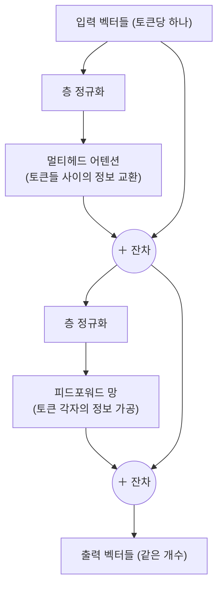

# 18장. Transformer — 현대 AI의 심장

> 이 장의 질문: **어텐션을 부품 삼아 완성한 건물은 어떻게 생겼는가?** Transformer 블록을 조립도 수준으로 해부하고, GPT·BERT가 그 위의 어떤 변주인지, 그리고 왜 이 구조가 모든 것을 집어삼켰는지 이해한다.
>
> 전제: 5장(소프트맥스), 11장(잔차, LayerNorm), 17장(어텐션).

## 블록 하나의 해부도

Transformer는 놀랍도록 반복적인 구조다 — **같은 블록을 수십 번 쌓은 탑**이며, 블록 하나는 단 두 개의 하위 층으로 이루어진다.

**하위 층 1 — 멀티헤드 어텐션 (섞는 단계).** 17장 그대로다. 토큰들이 서로를 바라보며 문맥 정보를 교환한다. 블록에서 토큰 **사이의** 소통은 오직 여기서만 일어난다.

**하위 층 2 — 피드포워드 망 (소화하는 단계).** 각 토큰의 벡터를 **독립적으로** 2층 MLP(9장의 그 MLP다 — 차원을 4배쯤 넓혔다가 되돌린다)에 통과시킨다. 어텐션으로 모아 온 정보를 각자 자리에서 가공·변환하는 단계다. 흥미롭게도 파라미터의 3분의 2가 여기에 있으며, 학습된 지식(사실, 패턴)의 상당 부분이 이 층들에 저장되는 것으로 이해되고 있다.

그리고 두 하위 층 모두에 11장의 두 무기가 감겨 있다 — **잔차 연결**(각 층은 수정분만 만든다; 기울기의 고속도로)과 **층 정규화**(크기 관리; 배치와 무관해 시퀀스에 적합). 이 블록을 $N$번 쌓으면($N$은 소형 모델 수 개, 대형 모델 수십~백여 개), 층을 지날수록 각 토큰의 벡터가 점점 깊은 문맥적 의미로 정제된다 — 9장의 표현 학습 위계가 언어에서 재현되는 것이다. 새로운 부품은 하나도 없다. **이 책에서 배운 부품들의 가장 우아한 조립**, 그것이 Transformer다.

## 세 가지 변주: 무엇을 가리느냐가 정체성이다

원조 Transformer는 번역기였다 — 원문을 읽는 **인코더**와 번역문을 쓰는 **디코더**의 2부 구성. 이후 각 부분이 독립해 세 가족이 되었고, 차이의 본질은 단 하나 — **어텐션이 어디까지 보게 허용하느냐(마스킹)** 다.

**인코더 계열 (BERT류) — 양방향으로 본다.** 모든 토큰이 앞뒤 모든 토큰을 본다. 학습은 문장 중간중간을 가리고 맞추기(빈칸 채우기 — 7장의 자기지도). 문장 전체를 조망한 이해가 강점이라, 분류·검색·개체 인식 같은 **이해 과제**와 16장의 문장 임베딩에 쓰인다.

**디코더 계열 (GPT류) — 왼쪽만 본다.** 각 토큰은 자기 **이전** 토큰들만 보도록 어텐션에 마스크를 씌운다(미래 봉인 — 인과적 마스킹). 왜? 학습 목표가 "다음 토큰 예측"이기 때문이다. 미래를 볼 수 있으면 커닝이 된다. 이 마스크 덕분에 훈련이 극도로 효율적이 된다 — 문장 하나를 한 번 통과시키면 **모든 위치가 동시에** "각자의 다음 토큰 맞추기" 문제를 푼다. 천 토큰 문장 = 천 개의 학습 문제를 병렬로. 그리고 생성 능력이 있는 쪽이 이쪽이라, 현대 LLM은 사실상 전부 디코더 계열이다.

**인코더-디코더 (T5, 번역기, Whisper) — 읽기와 쓰기의 분업.** 인코더가 입력(원문, 스펙트로그램)을 양방향으로 이해하고, 디코더가 인코더 출력을 어텐션으로 참조(**교차 어텐션**)하며 출력을 왼쪽부터 생성한다. 15장에서 예고한 음성 인식의 현대적 해법이 바로 이 구조다.

## GPT를 정확하게 정의하기

이제 이 책 전체의 부품으로 GPT를 한 문장에 정의할 수 있다.

> **GPT = 토큰 임베딩(16장) + 위치 정보(17장) + 인과 마스크를 쓴 Transformer 디코더 블록 $N$개 + 어휘 전체에 대한 소프트맥스(5장)로, "다음 토큰의 확률 분포" $p(x_t \mid x_{<t})$를 출력하는 모델(3장의 조건부 분포!).**

생성은 이 모델을 반복 호출하는 것이다: 분포에서 토큰 하나를 뽑고(온도·확률 상위권 자르기 등으로 창의성 조절 — 5장의 온도), 뽑은 토큰을 입력 끝에 붙여 다시 예측하고, 반복. 한 가지 실무적 비대칭을 짚어 두자 — 훈련은 전 위치 병렬이라 빨랐지만, **생성은 본질적으로 한 토큰씩 직렬**이다(다음 입력이 방금의 출력이므로). 챗봇이 타자 치듯 또박또박 출력하는 것은 연출이 아니라 이 직렬성의 실체이고, 매 토큰마다 과거 계산을 재활용하는 캐시(KV 캐시) 같은 서빙 기술이 발달한 이유다(27장).

크기 감각도 잡아 두자. 파라미터 수는 대략 (블록 수) × (블록당 파라미터)로 자라며, 블록당 파라미터는 벡터 차원의 제곱에 비례한다. 차원 수천, 블록 수십~백이면 수십억~수천억 — 2장의 $w, b$ 두 개에서 시작한 여정의 현재 스케일이다. 그러나 학습 방법은 한 글자도 바뀌지 않았다: 교차 엔트로피 손실, 역전파, AdamW.

## 왜 이 구조가 모든 것을 삼켰는가

Transformer는 언어에서 태어났지만 지금은 이미지(14장의 ViT), 오디오(Whisper), 단백질 구조, 로봇 제어까지 지배한다. 우연이 아니다 — 세 가지 성질의 합작이다.

**1. 범용의 입력 인터페이스.** Transformer가 요구하는 것은 "벡터의 나열"뿐이다. 무엇이든 토큰 벡터 열로 바꾸기만 하면 — 텍스트는 서브워드로, 이미지는 패치로, 오디오는 스펙트로그램 조각으로 — 같은 기계가 돌아간다. 4~5부 내내 강조한 "표현만 바꾸면 도구가 이식된다"의 종착역이다. 이 공용 인터페이스는 모달리티를 **섞는 것**도 쉽게 만든다 — 이미지 토큰과 텍스트 토큰을 한 줄에 이어 넣으면 그림을 보고 대화하는 모델이 된다(24장 근처에서 재회).

**2. 하드웨어와의 궁합.** 계산의 대부분이 큰 행렬 곱이라 GPU 효율이 극한으로 나온다(3장). 같은 예산으로 더 큰 모델을 더 많은 데이터로 학습시킬 수 있다는 뜻이다.

**3. 확장했을 때 무너지지 않는 구조.** 잔차와 정규화 덕에 수백 층을 쌓아도 학습이 되고(11장), 데이터와 파라미터를 늘리는 만큼 성능이 **예측 가능하게** 좋아진다는 것이 경험적으로 확인되었다(스케일링 법칙 — 21장의 주제다). "키우면 좋아진다"가 보장되는 구조에 자본이 몰리는 것은 필연이었다.

직접 지어 보라. [코드랩 08](/practice/08-transformer-from-scratch)에서 인코더-디코더 전체를, [코드랩 09](/practice/09-gpt-from-scratch)에서 GPT를 밑바닥부터 만들어 텍스트를 학습시키고 생성까지 해 본다. 특히 코드랩 09는 이 책 전체에서 가장 보람찬 실습이다 — 당신이 만든 수백만 파라미터짜리 미니 GPT가 그럴듯한 문장을 뱉기 시작하는 순간, 7부의 이야기가 전부 실감으로 바뀐다.

## 핵심 요약

- Transformer 블록 = **어텐션(토큰 간 소통) + 피드포워드(토큰별 가공)**, 각각에 잔차와 층 정규화. 이 블록의 반복이 전부이며, 새 부품은 없다 — 기존 부품의 조립이다.
- 세 가족의 차이는 **마스킹**: 양방향(BERT, 이해), 인과적(GPT, 생성 — 전 위치 병렬 학습의 묘수), 인코더-디코더(변환 과제).
- **GPT = 인과 디코더 탑 + 소프트맥스 = 다음 토큰의 조건부 분포.** 훈련은 병렬, 생성은 직렬. 학습법은 여전히 교차 엔트로피 + 역전파 + AdamW.
- 제패의 이유: 벡터 나열이면 무엇이든 받는 범용 인터페이스, GPU 궁합, 그리고 키울수록 예측 가능하게 좋아지는 확장성.

## 스스로 점검

1. 블록에서 "토큰 사이의 정보 교환"과 "토큰 각자의 가공"을 담당하는 부분을 각각 짚고, 둘의 역할 분담을 자기 말로 설명해 보라.
2. 인과 마스크가 "천 토큰 문장 = 천 개의 병렬 학습 문제"를 가능하게 하는 이유를 설명해 보라. 마스크 없이 다음 토큰 예측을 학습하면 무엇이 무너지는가?
3. BERT류 모델로는 왜 자연스러운 글 생성이 어려운가?
4. ViT(14장)와 GPT의 공통점과 차이점을 "입력 표현"과 "마스킹" 두 축으로 정리해 보라.

## 다음 장에서

5부가 끝났다 — [5부 복습 퀴즈](/review/quiz-part5)로 점검하라. 6부는 방향을 바꾼다. 지금까지의 모델은 주로 구분하고 이해했다 — 이제 **만들어내는** 모델이다. "그럴듯한 새 데이터를 생성한다"는 것이 수학적으로 무슨 뜻인지부터 시작해, 두 고전(VAE, GAN)의 상반된 철학을 만난다.

[19장. 만들어내는 기계 — 생성 모델 →](/book/19-generative-models)
