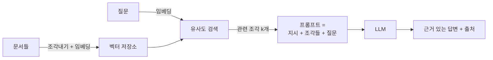

# 23장. LLM 활용의 기술

> 이 장의 질문: **길들여진 모델을 실제 문제에 어떻게 쓰는가?** 프롬프트, 검색 증강(RAG), 파인튜닝 — 세 도구의 원리와 선택 기준을 세워, "무엇을 언제 쓰는가"라는 실무의 첫 질문에 답할 수 있게 한다.
>
> 전제: 16장(임베딩·의미 검색), 21장(LLM의 한계), 22장(정렬).

## 세 개의 다이얼

LLM으로 문제를 풀 때 손댈 수 있는 곳은 셋뿐이다. **입력을 바꾸거나**(프롬프트), **입력에 정보를 더하거나**(검색 증강), **모델 자체를 바꾸거나**(파인튜닝). 비용과 난이도는 이 순서로 오르고, 실무의 철칙도 이 순서다 — **왼쪽부터 시도하고, 그것으로 안 될 때만 오른쪽으로 간다.**

## 다이얼 1: 프롬프트 — 문맥으로 프로그래밍하기

21장의 문맥 내 학습을 떠올려라. 충분히 큰 모델은 프롬프트 안의 정보만으로 행동을 바꾼다. 그러니 프롬프트는 자연어로 쓰는 프로그램이다. 원리에서 도출되는 기법 몇 가지:

- **역할과 목표를 먼저 못박아라.** 모델은 문맥의 통계를 따른다(21장). "당신은 세무 전문가입니다. 답변은 관련 법조문을 인용하며…"라는 문맥은 그런 문서들의 분포로 모델을 이동시킨다.
- **예시를 보여라.** 원하는 출력 형식의 예시 2~5개(few-shot)는 설명 열 줄보다 강하다 — 문맥 내 학습 그 자체다.
- **생각할 공간을 줘라.** "단계별로 추론한 뒤 답하라"는 21장에서 본 이유로 — 한 토큰이 한 번의 계산이라서 — 복잡한 문제의 정확도를 올린다. 최신 모델들은 이를 내장(추론 토큰)하고 있으니, 그런 모델에는 목표만 명확히 주는 편이 낫다.
- **출력을 구조화하라.** JSON 등 기계가 읽을 형식을 지정하고, 가능하면 API의 구조화 출력 기능으로 강제하라. 자유 텍스트를 파싱하는 코드는 늘 깨진다.
- **넣지 말아야 할 것도 정하라.** 프롬프트에 사용자 입력을 그대로 섞으면, 사용자가 "이전 지시를 무시하고…"라고 써서 시스템을 탈취할 수 있다(프롬프트 주입). 지시와 데이터를 구분해 넣고, 중요한 행동은 모델의 말만 믿지 말고 코드로 검증하라.

프롬프트의 한계도 원리에서 나온다. 모델이 **모르는 것**은 프롬프트로 알게 만들 수 없고(지식 마감일, 사내 문서), 문맥 창은 유한하며 길수록 비싸고 느리다(17장의 길이 제곱). 여기서 두 번째 다이얼이 필요해진다.

## 다이얼 2: 검색 증강 생성(RAG) — 모르는 것은 찾아서 준다

문제: 회사 내부 규정 3천 페이지에 대해 질문에 답하는 챗봇. 모델은 그 문서를 본 적이 없고(21장의 마감일·비공개 데이터), 3천 페이지를 통째로 프롬프트에 넣을 수도 없다.

해법은 두 단계의 조합이다 — **질문과 관련된 부분만 찾아서(검색), 그것을 프롬프트에 넣어 답하게 한다(생성).** 검색은 16장의 의미 검색이다: 문서를 적당한 크기의 조각으로 잘라 각 조각을 임베딩 벡터로 만들어 저장해 두고, 질문이 오면 질문 벡터와 가까운 조각들을 꺼낸다. 생성은 "다음 문서 발췌만 근거로 답하고, 없으면 없다고 하라"는 프롬프트에 그 조각들을 붙이는 것이다.

RAG가 해결하는 것을 21장의 한계 목록과 대조해 보라 — 지식 마감일(최신 문서를 넣으면 된다), 비공개 지식(사내 문서), 그리고 환각(근거를 주고 근거 밖은 말하지 말라고 하면 크게 준다). 게다가 **출처를 제시**할 수 있어 사람이 검증 가능하고, 문서가 바뀌면 재학습 없이 저장소만 갱신하면 된다. 실무 LLM 시스템의 대다수가 어떤 형태로든 RAG인 이유다.

그리고 RAG가 실패하는 원인의 대부분은 생성이 아니라 **검색**에 있다. 관련 조각을 못 찾으면 아무리 좋은 모델도 답할 수 없다. 8장의 규율이 그대로 적용된다 — 검색 품질을 따로 측정하라(정답 조각이 상위 k개 안에 든 비율). 조각 크기(너무 크면 임베딩이 뭉개지고, 너무 작으면 맥락이 잘림), 키워드 검색과의 결합(제품 코드·고유명사는 의미 검색이 약하다 — 16장의 점검 문제), 1차 검색 후 정밀 재순위화 등이 검색 품질의 다이얼이다. [코드랩 12](/practice/12-rag-system)에서 이 파이프라인 전체를 평가 지표까지 포함해 직접 짓는다.

## 다이얼 3: 파인튜닝 — 모델 자체를 바꾼다

앞의 두 다이얼로 안 되는 것이 있다. 특정 문체·형식을 **항상, 일관되게** 지키게 하는 것, 프롬프트에 매번 넣기엔 너무 긴 규칙을 체화시키는 것, 전문 분야의 어휘와 관습을 내재화하는 것, 그리고 작은 모델로 비용·지연을 줄이면서 특정 과제 성능을 유지하는 것. 이럴 때 22장의 SFT를 내 데이터로 하는 것이 **파인튜닝**이다.

두 가지를 분명히 하자. 첫째, **파인튜닝은 지식 주입에 비효율적이다.** 수천 건의 사내 문서로 미세조정해도 모델은 그 사실들을 신뢰성 있게 기억하지 못한다 — 사전학습에서 사실 하나가 수백 번 반복 노출되어야 저장되는 것과 같은 이유다. 지식은 RAG로, **행동과 형식은 파인튜닝으로.** 이 구분이 가장 흔한 실패를 막는다. 둘째, 데이터 품질이 전부다. 들쭉날쭉한 예시 만 건보다 일관된 예시 천 건이 낫다(22장의 SFT 원칙).

비용 문제는 기술이 해결했다. 수백억 파라미터를 전부 갱신하는 대신, 가중치 행렬의 **변화분만 작은 저차원 행렬 두 개의 곱으로** 학습하는 기법(LoRA — 7장 PCA의 "본질은 저차원에 산다"가 여기서도)이 표준이다. 학습 파라미터가 1% 이하로 줄어 소비자 GPU 한 장으로 대형 모델을 조정하고, 결과물은 수십 MB짜리 "어댑터"라 과제별로 갈아 끼울 수 있다. [코드랩 11](/practice/11-lora-finetuning)에서 실습한다.

## 선택 기준 — 한 장의 표

| 증상 | 처방 | 이유 |
|---|---|---|
| 답은 아는데 형식·태도가 마음에 안 든다 | 프롬프트 | 문맥 내 학습으로 충분 |
| 모델이 모르는 사실·최신 정보·내부 문서 | RAG | 지식은 넣어 주는 것, 심는 것이 아니다 |
| 형식·문체를 매번 일관되게, 프롬프트가 너무 길다 | 파인튜닝 | 행동의 체화 |
| 비용·지연을 줄이면서 특정 과제 유지 | 작은 모델 파인튜닝 (+RAG) | 범용성을 팔아 효율을 산다 |
| 환각을 줄이고 출처를 대야 한다 | RAG + "근거 밖은 말하지 말라" | 검증 가능성 |

셋은 배타적이지 않다 — 성숙한 시스템은 파인튜닝된 모델에 RAG를 붙이고 잘 설계된 프롬프트로 운용한다. 그리고 어느 경우든 8장의 규율은 살아 있다: 자기 과제의 평가 세트를 만들고, 변경 전후를 측정하라. "느낌상 좋아졌다"는 LLM 시대에도 소문일 뿐이다. 평가에 LLM을 채점자로 쓰는 것(LLM-as-judge)도 흔하지만, 채점자의 편향(장황한 답 선호 등)을 사람 채점과 대조해 검증한 뒤 믿어야 한다.

## 핵심 요약

- LLM 활용의 세 다이얼: **프롬프트(입력) → RAG(입력에 정보 추가) → 파인튜닝(모델 변경).** 왼쪽부터 시도한다.
- 프롬프트는 문맥 내 학습을 이용한 자연어 프로그래밍 — 역할·예시·추론 공간·구조화 출력, 그리고 프롬프트 주입 방어.
- **RAG** = 의미 검색 + 근거 기반 생성. 지식 마감일·비공개 지식·환각·출처 문제를 함께 다루며, 실패의 대부분은 검색에 있다 — 검색을 따로 측정하라.
- **파인튜닝**은 행동과 형식의 체화이지 지식 주입이 아니다. LoRA로 비용은 해결됐고, 남는 것은 데이터 품질이다.
- 셋을 조합하되, 언제나 자기 과제의 평가 세트로 측정한다.

## 스스로 점검

1. "사내 규정 챗봇을 만들려고 규정집으로 파인튜닝했더니 자꾸 틀린 조항을 댄다" — 무엇이 잘못됐고 무엇으로 바꿔야 하나?
2. RAG 시스템의 답이 틀렸을 때, 검색 문제인지 생성 문제인지 구분하는 실험을 설계해 보라.
3. 프롬프트 주입 공격의 예를 하나 만들고, 방어책 두 가지를 제시해 보라.
4. LoRA가 "변화분은 저차원"이라는 가정 위에 서 있다고 했다. 이 가정이 그럴듯한 이유를 7장·13장의 관점(본질은 저차원, 전이학습은 표현의 재활용)에서 설명해 보라.

## 다음 장에서

지금까지 LLM은 텍스트를 받아 텍스트를 내놓았다. 다음 장에서는 LLM에게 **손**을 준다 — 검색하고, 계산하고, 코드를 실행하고, 파일을 고치는 도구를 쥐어 주고, 목표를 향해 여러 단계를 스스로 계획·실행하게 하는 것. 에이전트다. 원리는 놀랍도록 단순한 반복문 하나이고, 어려움은 전부 안전에 있다.

[24장. 행동하는 언어 — 에이전트 →](/book/24-agents)
