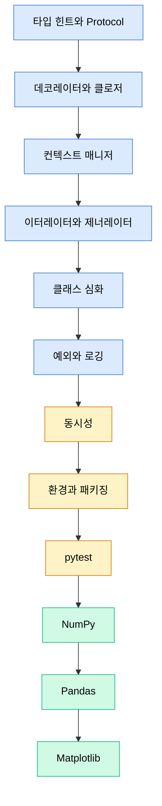

# Part 01 · Python Foundations

## 이 파트의 목표

문법 입문이 아니다. 수만 줄 규모의 학습 코드베이스에서 실제로 문제를 일으키는 지점을 다룬다. 타입이 무너져 런타임에 터지는 코드, GPU가 놀고 있는데 CPU 전처리가 병목인 DataLoader, 프로세스가 죽어도 파일 핸들이 남는 체크포인트 로직, 브로드캐스팅 규칙을 잘못 이해해 조용히 틀린 값을 계산하는 손실함수가 대상이다.

Part 05의 PyTorch 학습 루프는 이 파트의 컨텍스트 매니저, 제너레이터, 멀티프로세싱, NumPy 메모리 레이아웃 위에 그대로 얹힌다. 여기서 확실히 다지지 않으면 이후 파트에서 "왜 이렇게 쓰는가"가 계속 미해결로 남는다.

## 학습 순서

앞의 여섯 편은 언어 자체의 실행 모델이다. 가운데 세 편은 코드베이스 운영에 관한 것이고, 마지막 세 편은 수치 계산 스택이다. 시간이 부족하면 언어 여섯 편과 NumPy 한 편을 먼저 읽고 나머지는 필요할 때 돌아온다.

## 각 문서에서 확인할 것

| 문서 | 핵심 질문 |
| --- | --- |
| 타입 힌트와 Protocol | 왜 `Protocol`이 `ABC`보다 라이브러리 경계에 적합한가 |
| 데코레이터와 클로저 | `functools.wraps`를 빼면 정확히 무엇이 깨지는가 |
| 컨텍스트 매니저 | 예외가 발생해도 GPU 메모리와 파일 핸들이 회수되는 경로는 무엇인가 |
| 이터레이터와 제너레이터 | 지연 평가가 메모리 사용량을 몇 배 줄이는가, 측정 방법은 |
| 클래스 심화 | `__slots__`가 인스턴스 100만 개에서 얼마를 줄이는가 |
| 예외와 로깅 | 분산 학습에서 워커별 로그를 어떻게 구분 가능하게 만드는가 |
| 동시성 | 전처리는 프로세스, 네트워크 I/O는 코루틴인 이유 |
| 환경과 패키징 | 재현 가능한 환경의 최소 조건은 무엇인가 |
| pytest | 학습 코드에서 무엇을 테스트할 수 있는가 |
| NumPy | 스트라이드가 바뀌는 연산과 복사가 일어나는 연산의 구분 |
| Pandas | `groupby`가 왜 느린가, 언제 NumPy로 내려가야 하는가 |
| Matplotlib | figure/axes 구조를 잡고 나면 나머지가 왜 단순해지는가 |
