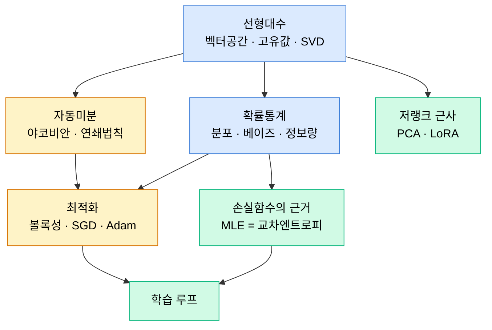

# Part 02 · Mathematics for AI

## 이 파트의 목표

AI에서 쓰이는 수학은 넓지 않다. 선형대수, 미적분과 자동미분, 확률통계, 최적화 네 축이 전부다. 문제는 깊이다. 공식을 외운 상태로는 "왜 어텐션에 $\sqrt{d_k}$로 나누는가", "왜 LoRA의 랭크가 8이면 충분한가", "왜 Adam이 weight decay와 충돌하는가" 같은 질문에 답할 수 없다. 이 파트는 그 답이 나오는 지점까지 유도한다.

모든 문서는 정의 → 공식 → 기하학적 의미 → AI 활용 사례 순으로 구성한다. 기하학적 의미를 건너뛰지 않는 이유는, 실무에서 마주치는 대부분의 직관적 판단이 대수적 조작이 아니라 공간적 그림에서 나오기 때문이다.

## 네 축의 연결 관계

## 학습 순서

선형대수 여섯 편(01~06), 미적분과 자동미분 다섯 편(07~11), 확률통계 네 편(12~15), 최적화 세 편(16~18) 순이다.

역전파 유도(10)는 야코비안(08)과 연쇄법칙(09)에 의존하고, 이 둘은 그래디언트(07)에 의존한다. 이 사슬은 건너뛸 수 없다. 반대로 확률통계 네 편은 선형대수와 독립적으로 읽을 수 있다.

최적화 세 편은 Part 04와 Part 05에서 직접 재사용된다. AdamW의 $\epsilon$을 어디에 두느냐로 학습이 갈리는 사례를 17번 문서에서 다룬다.

## 이 파트가 뒤에서 회수되는 지점

| Part 02 내용 | 회수되는 곳 |
| --- | --- |
| SVD와 저랭크 근사 | Part 03 PCA, Part 10 LoRA |
| 야코비안과 후방 모드 자동미분 | Part 05 autograd 내부 |
| KL 발산 | Part 09 VAE의 ELBO, Part 10 DPO |
| 교차엔트로피와 MLE의 등가성 | Part 03 로지스틱회귀, Part 04 손실함수 |
| 라그랑주 승수와 쌍대성 | Part 03 SVM 쌍대 문제 |
| 볼록성과 립시츠 상수 | Part 04 학습률 선택, Part 02 스케줄 |
| 가우시안 분포의 성질 | Part 09 확산 모델 순방향 과정 |
