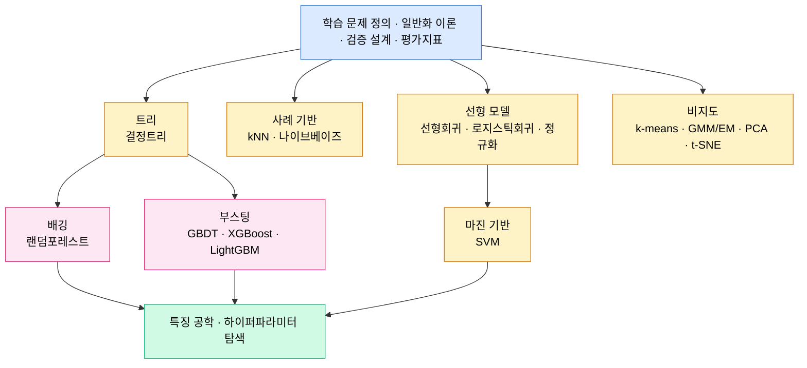

# Part 03 · Machine Learning

## 이 파트의 목표

딥러닝으로 바로 넘어가면 놓치는 것들이 있다. 편향-분산 분해, 데이터 누수, 임계값 튜닝, 교차검증 설계는 신경망에서도 그대로 적용되지만 신경망 문서에서는 잘 다루지 않는다. 또한 테이블 데이터에서는 여전히 GBDT가 기본 선택지이고, 실무 문제의 상당수가 테이블 데이터다.

이 파트의 알고리즘은 모두 손으로 유도하고 NumPy로 구현한 뒤 scikit-learn 결과와 대조한다. 라이브러리 호출법을 익히는 것이 목적이 아니라, 라이브러리가 내부에서 무엇을 푸는지 알아야 하이퍼파라미터가 의미를 갖기 때문이다.

## 알고리즘 지도

## 학습 순서

앞의 네 편(01~04)은 알고리즘이 아니라 틀이다. 이 틀 없이 알고리즘부터 읽으면 "정확도 94퍼센트"가 좋은 결과인지 판단할 수 없다. 반드시 먼저 읽는다.

05~13은 지도학습 알고리즘이다. 선형회귀 → 로지스틱회귀 → 정규화 순서는 강하게 연결되어 있으므로 붙여서 읽는다. SVM은 Part 02의 라그랑주 승수를 전제한다.

14~15는 비지도학습이다. PCA는 Part 02의 SVD 문서와 짝을 이룬다. GMM의 EM 유도는 Part 09의 VAE ELBO 유도와 구조가 같으므로, 여기서 확실히 이해하면 뒤가 쉬워진다.

16~17은 실전 파이프라인이다.

## 선택 기준 요약

| 상황 | 첫 선택 | 이유 |
| --- | --- | --- |
| 테이블 데이터, 수천~수백만 행 | LightGBM | 전처리 요구가 낮고 성능 대비 학습이 빠르다 |
| 해석 가능성이 요건 | 정규화 선형 모델 | 계수가 직접 해석되고 신뢰구간을 붙일 수 있다 |
| 샘플 수가 특징 수보다 훨씬 적음 | L2 선형 모델, 커널 SVM | 고차원 소표본에서 마진 기반이 안정적이다 |
| 고차원 범주형이 지배적 | CatBoost | 순서형 타깃 인코딩이 누수를 억제한다 |
| 비정형 데이터(이미지, 텍스트) | 딥러닝 | 특징 공학을 표현 학습이 대체한다 |
| 레이블이 거의 없음 | 자기지도 사전학습 후 소량 파인튜닝 | 레이블 효율이 결정적이다 |
