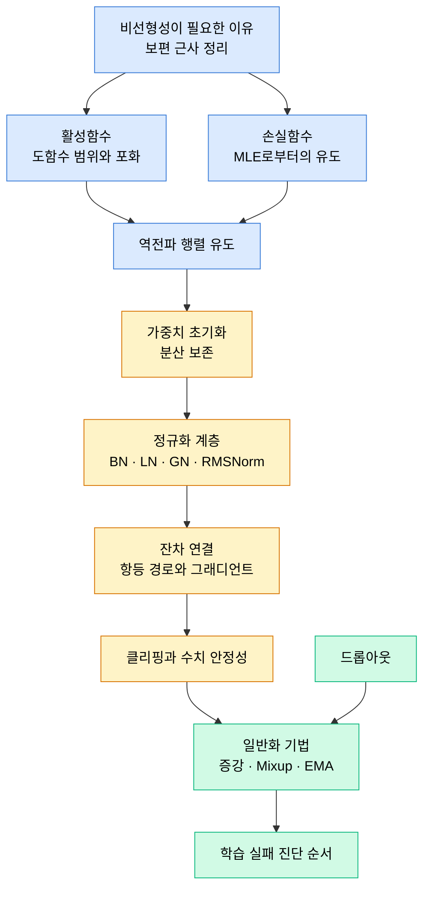

# Part 04 · Deep Learning Fundamentals

## 이 파트의 목표

신경망 학습이 실패하는 방식은 놀랄 만큼 정형화되어 있다. 손실이 NaN이 되거나, 초기 몇 스텝 뒤 평평해지거나, 학습 손실만 떨어지고 검증 손실이 오르거나, 배치 크기를 바꾼 순간 성능이 무너진다. 이 네 가지의 원인은 각각 수치 안정성, 그래디언트 흐름, 정규화 부족, 정규화 계층의 통계 붕괴로 거의 정해져 있다.

이 파트는 그 인과를 수식 수준에서 설명한다. 활성함수의 도함수 범위가 왜 깊이에 따라 신호를 죽이는지, He 초기화의 $2/n$이 어디서 나오는지, BatchNorm이 배치 크기 8 아래에서 왜 불안정한지를 유도로 보인다. 프레임워크에 의존하지 않는 내용이므로 Part 05 이전에 읽는다.

## 개념 사슬

## 반드시 붙잡아야 할 세 가지

첫째, 순전파의 분산이 층을 지나며 보존되어야 한다는 조건이 초기화 공식 전체를 결정한다. Xavier와 He의 차이는 활성함수가 입력의 절반을 죽이느냐 아니냐 하나뿐이다.

둘째, 정규화 계층의 선택은 배치 통계를 신뢰할 수 있느냐로 갈린다. BatchNorm은 배치 방향 통계를, LayerNorm은 특징 방향 통계를 쓴다. 시퀀스 길이가 가변이고 배치가 작은 Transformer에서 LayerNorm이 표준이 된 이유가 여기 있다.

셋째, 잔차 연결은 그래디언트를 "더 크게" 만드는 것이 아니라 항등 경로를 통해 그래디언트가 감쇠 없이 흐르는 우회로를 만든다. 수식으로 보면 야코비안에 단위행렬이 더해지는 것뿐이다.

## 진단 순서 미리보기

10번 문서에서 상세히 다루지만, 순서만 먼저 기억한다.

1. 데이터 한 배치를 과적합시켜본다. 손실이 0에 가까워지지 않으면 모델이나 손실 정의가 잘못된 것이다.
2. 그래디언트 노름을 층별로 찍는다. 특정 층에서 0 또는 폭발이면 초기화와 정규화 위치를 본다.
3. 학습률을 10배 낮춰본다. 손실이 안정되면 스케줄과 워밍업 문제다.
4. 레이블과 입력의 대응을 눈으로 확인한다. 셔플 버그가 여기서 잡힌다.
5. 검증 손실만 오른다면 정규화와 데이터 양의 문제다.
