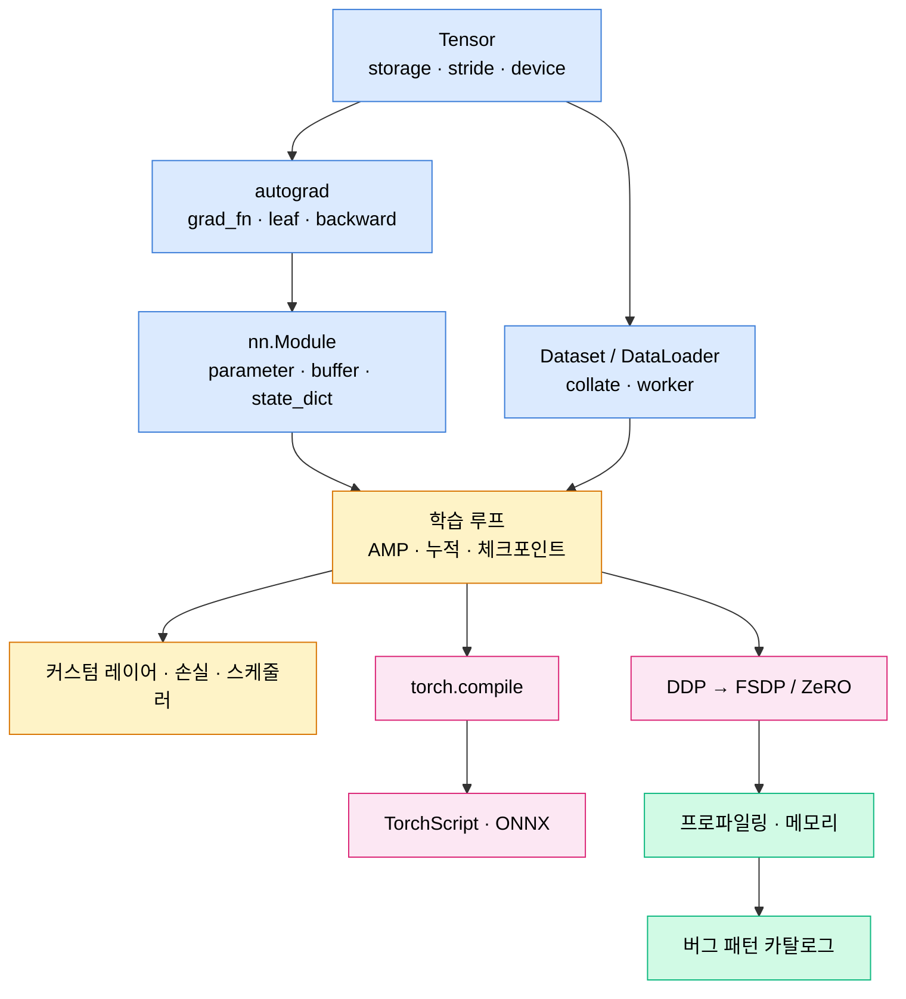

# Part 05 · PyTorch

## 이 파트의 목표

PyTorch를 "쓸 줄 아는" 것과 "무엇이 일어나는지 아는" 것 사이의 간격이 실무 생산성을 결정한다. 이 파트는 후자를 목표로 한다. 텐서가 메모리를 어떻게 잡는지, autograd 그래프가 언제 만들어지고 언제 해제되는지, DDP가 backward 도중에 무엇을 하는지, torch.compile이 어디서 그래프를 끊는지를 다룬다.

Part 04까지의 내용이 프레임워크 독립적이었다면, 여기서부터는 구현 세부가 성능과 정확성을 직접 좌우한다.

## 계층 구조

## 학습 순서

01~04는 반드시 순서대로 읽는다. `stride`와 `contiguous`를 모르면 `view`가 실패하는 이유를 설명할 수 없고, `grad_fn`을 모르면 `detach`를 언제 써야 하는지 판단할 수 없다.

05번 문서의 학습 루프 템플릿은 이 아카이브 전체에서 재사용된다. AMP, 그래디언트 누적, 시드 고정, 체크포인트 저장과 복원, 실험 추적 훅이 모두 들어간 형태이며 이후 파트의 학습 코드는 이 템플릿을 전제로 축약된다.

09~10의 분산학습은 Part 13의 통신 알고리즘과 메모리 계산 문서를 참조한다. 두 파트를 나란히 읽으면 "왜 ZeRO-3에서 통신량이 늘어나는가"가 명확해진다.

## 버그 패턴 빠른 참조

| 증상 | 최우선 확인 |
| --- | --- |
| loss가 NaN | AMP 스케일러 누락, log(0), 학습률 과대 |
| 검증 성능이 학습과 크게 다름 | `model.eval()` 호출 누락, BN 통계 |
| CUDA out of memory가 점점 심해짐 | 손실 텐서를 리스트에 그대로 누적 |
| 첫 스텝만 느리고 이후 정상 | cuDNN 벤치마크 워밍업, compile 컴파일 시간 |
| 매 에폭 처음에 GPU 사용률 0퍼센트 | `persistent_workers=False`로 워커 재생성 |
| DataLoader가 멈춤 | 워커 안에서 CUDA 텐서 생성, fork와 스레드 충돌 |
| 그래디언트가 전부 None | `zero_grad` 이후 `backward` 누락, `requires_grad=False` |
| DDP에서 손실이 발산 | 프로세스별 시드 동일, 샘플러 `set_epoch` 누락 |
