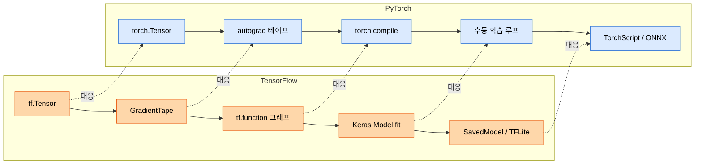

# Part 06 · TensorFlow and Keras

## 이 파트의 목표

이 아카이브의 주 프레임워크는 PyTorch다. TensorFlow를 다루는 이유는 두 가지다. 첫째, 레거시 서빙 스택과 모바일 배포(TFLite)에서 여전히 마주치기 때문이다. 둘째, 같은 개념을 다른 API로 다시 보면 개념과 구현을 분리해서 이해하게 되기 때문이다.

`tf.function`의 그래프 모드와 PyTorch의 `torch.compile`은 같은 문제를 다른 방향에서 푼다. `GradientTape`와 autograd의 테이프 기반 기록도 마찬가지다. 이 대조가 이 파트의 핵심 가치다.

## 대조 구조

## 학습 순서

01~02가 실행 모델의 차이를 다룬다. 여기가 가장 중요하다. `tf.function`이 파이썬 코드를 추적해 그래프로 굳히는 과정에서 발생하는 재추적(retracing) 문제는 TensorFlow 성능 문제의 대부분을 차지한다.

03~05는 Keras 3의 API다. Sequential, Functional, Subclassing 세 방식의 선택 기준을 명확히 한다.

06번은 API 대조표와 동일한 CNN을 양쪽으로 구현한 전체 코드다. Part 07의 CNN 문서를 읽은 뒤 보면 효과가 크다.

07번은 배포 포맷이다. Part 12의 서빙 문서와 이어진다.

## 언제 TensorFlow를 선택하는가

| 상황 | 판단 |
| --- | --- |
| 신규 연구 프로젝트 | PyTorch. 생태계와 논문 구현체 가용성이 압도적이다 |
| 모바일 온디바이스 추론 | TFLite가 성숙하다. 다만 ONNX Runtime Mobile도 검토한다 |
| 기존 TFX 파이프라인 운영 중 | TensorFlow 유지. 전환 비용이 이득을 넘는다 |
| TPU 대규모 학습 | JAX 또는 TensorFlow |
| 팀 전체가 PyTorch 숙련 | PyTorch. 프레임워크 다양성보다 숙련도가 중요하다 |
