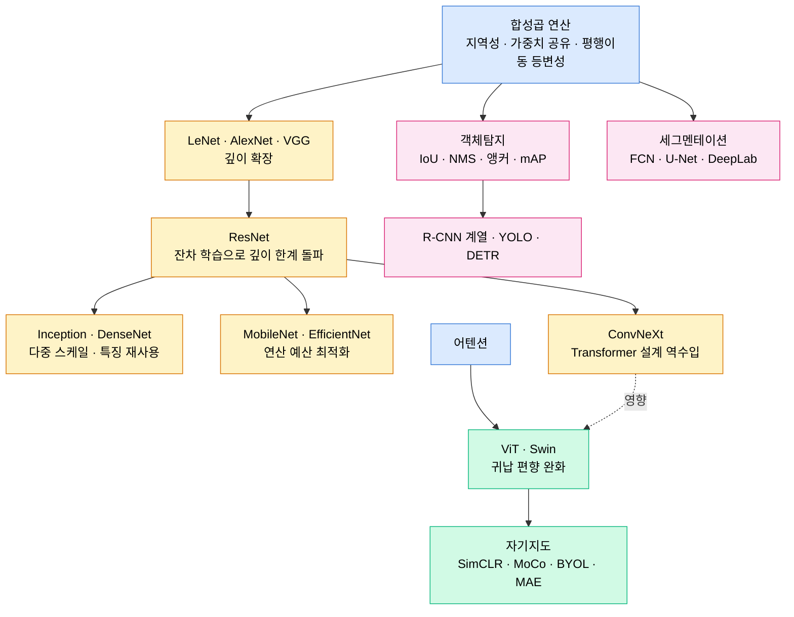

# Part 07 · Computer Vision

## 이 파트의 목표

컴퓨터 비전은 아키텍처 카탈로그를 외우는 분야가 아니다. 합성곱이라는 하나의 연산에 어떤 귀납 편향이 들어 있고, 그 편향을 완화하거나 강화하려는 시도가 어떻게 아키텍처 계보를 만들었는지를 따라가는 것이 목표다.

VGG에서 ResNet으로의 이동은 깊이의 문제였고, ResNet에서 MobileNet으로의 이동은 연산량의 문제였으며, CNN에서 ViT로의 이동은 귀납 편향과 데이터 규모의 교환이었다. 각 전환점에서 무엇을 포기하고 무엇을 얻었는지를 수식과 파라미터 수 계산으로 확인한다.

## 아키텍처 계보

## 학습 순서

01~02는 연산 자체다. 출력 크기 공식과 수용영역 계산은 손으로 할 수 있어야 한다. 모델 설계 중 형상이 맞지 않아 멈추는 시간의 대부분이 여기서 절약된다.

03~05는 분류 아키텍처 계보다. 06번 전이학습은 실무에서 가장 자주 쓰는 작업이므로 밀도를 높였다.

07~09는 탐지와 세그멘테이션이다. 07번의 mAP 계산 과정은 손으로 따라가야 한다. 평가지표를 오해한 채 모델을 비교하는 사고가 흔하다.

10~11은 Transformer 계열과 자기지도다. Part 08의 어텐션 문서를 먼저 읽는 편이 자연스럽지만, ViT 문서 안에서도 필요한 만큼 다시 설명한다.

## 작업 유형별 첫 선택

| 작업 | 기본 선택 | 비고 |
| --- | --- | --- |
| 이미지 분류, 데이터 1만 장 미만 | ImageNet 사전학습 ResNet-50 또는 ConvNeXt-T 파인튜닝 | 처음부터 학습하지 않는다 |
| 이미지 분류, 데이터 100만 장 이상 | ViT-B 이상 | 데이터가 많으면 귀납 편향이 덜 필요하다 |
| 실시간 탐지 | YOLO 계열 | 지연 예산이 명확할 때 |
| 정밀 탐지, 지연 여유 | DETR 계열 또는 2-stage | NMS 튜닝 부담이 줄어든다 |
| 의료 영상 세그멘테이션 | U-Net 계열 | 소량 데이터에서 안정적이다 |
| 레이블 없는 대량 이미지 | MAE 사전학습 후 파인튜닝 | 레이블 예산이 부족할 때 |
