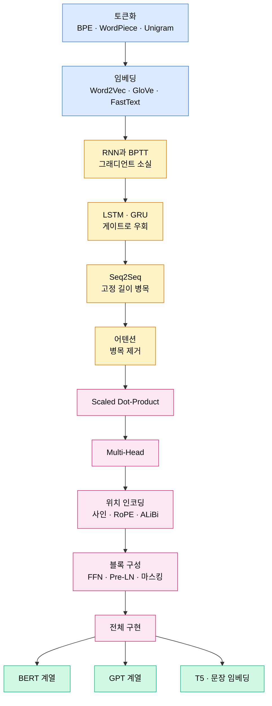

# Part 08 · Sequence Models and NLP

## 이 파트의 목표

Transformer를 처음부터 끝까지 직접 구현할 수 있게 만드는 것이 이 파트의 도착점이다. 다만 Transformer만 떼어 읽으면 각 설계 선택의 이유를 알 수 없다. RNN이 왜 긴 의존을 못 배웠는지, LSTM 게이트가 그 문제를 어떻게 우회했는지, 그럼에도 남은 순차 계산 병목이 어텐션을 어떻게 불러왔는지를 순서대로 따라가야 한다.

토큰화는 별개 주제처럼 보이지만 실무 실패의 진원지인 경우가 많다. 어휘 밖 토큰 처리, 다국어 압축률 편차, 숫자 분할 방식이 모델 성능에 직접 영향을 준다. 그래서 첫 문서로 둔다.

## 계보와 의존 관계

## 학습 순서

01~05는 Transformer 이전사다. 건너뛰고 06으로 가도 코드는 돌아가지만, "왜 어텐션인가"를 설명할 수 없게 된다.

06~10이 이 파트의 중심이다. 특히 09번의 마스킹과 10번의 전체 구현은 형상 변화를 한 줄씩 추적하며 읽는다. 텐서 형상이 $(B, L, d) \to (B, H, L, d_h) \to (B, H, L, L) \to (B, L, d)$로 변하는 흐름이 손에 익어야 Part 10의 KV 캐시와 FlashAttention이 이해된다.

11~13은 사전학습 패러다임의 분기다. Part 10의 LLM 엔지니어링은 12번의 인과 언어 모델링을 전제로 시작한다.

## 이 파트가 Part 10에 넘겨주는 것

| Part 08 내용 | Part 10에서의 확장 |
| --- | --- |
| Scaled Dot-Product Attention | FlashAttention의 IO 인식 타일링 |
| Multi-Head Attention의 KV 형상 | MQA/GQA와 KV 캐시 메모리 계산 |
| 위치 인코딩 RoPE | 긴 컨텍스트 확장(NTK, YaRN) |
| FFN 확장 비율 | SwiGLU와 MoE 라우팅 |
| Pre-LN | RMSNorm 채택 |
| 인과 마스크 | Speculative Decoding의 검증 단계 |
| GPT 사전학습 | 스케일링 법칙, SFT, RLHF, DPO |
