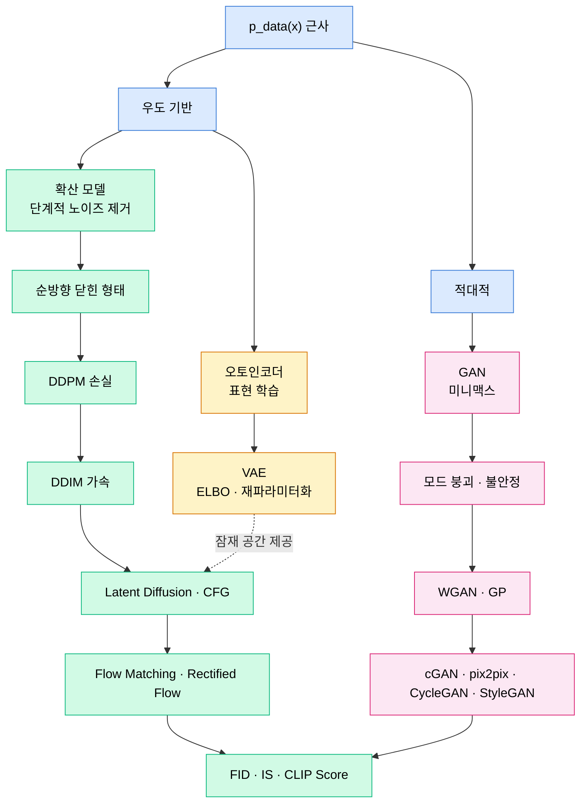

# Part 09 · Generative Models

## 이 파트의 목표

생성 모델은 모두 하나의 질문에 답한다. 데이터 분포 $p_{data}(x)$를 어떻게 근사할 것인가. 답하는 방식이 갈리면서 계보가 나뉜다. 우도를 직접 최대화하려다 다루기 힘든 적분을 만나면 변분 하한으로 우회하고(VAE), 우도를 포기하고 판별자와의 게임으로 대체하면 GAN이 되며, 데이터를 점진적으로 파괴한 뒤 그 역과정을 학습하면 확산 모델이 된다.

이 파트는 세 계보의 목적함수를 각각 처음부터 유도한다. 특히 DDPM 손실은 ELBO에서 시작해 노이즈 예측 형태 $\|\epsilon - \epsilon_\theta(x_t, t)\|^2$까지 중간 단계를 생략 없이 전개한다. 이 유도가 확산 모델 실무의 거의 모든 판단(스케줄 선택, 예측 타깃 선택, 가이던스 강도)의 근거가 된다.

## 세 계보의 분기

## 학습 순서

01~02를 먼저 읽는다. VAE의 ELBO 유도는 Part 03의 EM 알고리즘과 구조가 같고, Part 10의 DPO 유도에서도 같은 종류의 변분 논증이 나온다.

03~05는 GAN이다. 현재 생성 품질의 최전선은 확산 모델이지만, GAN은 실시간 생성과 이미지 변환에서 여전히 쓰이며 무엇보다 적대적 학습이라는 사고 도구를 준다.

06~10이 확산 모델이다. 순서대로 읽지 않으면 이해가 무너진다. 특히 06번의 순방향 닫힌 형태 $x_t = \sqrt{\bar{\alpha}_t}x_0 + \sqrt{1-\bar{\alpha}_t}\epsilon$ 유도가 이후 전부의 출발점이다.

11번은 평가다. FID 하나만 보고 모델을 고르는 실수를 막는 것이 목적이다.

## 선택 기준

| 요구 | 선택 | 이유 |
| --- | --- | --- |
| 최고 품질 이미지 생성 | Latent Diffusion + CFG | 현재 품질-제어 균형이 가장 좋다 |
| 밀리초 단위 실시간 생성 | GAN 또는 증류된 확산 모델 | 확산은 다단계 샘플링이 비싸다 |
| 잠재 표현이 필요한 이상 탐지 | VAE | 명시적 잠재 분포와 재구성 오차를 함께 준다 |
| 페어 없는 도메인 변환 | CycleGAN | 순환 일관성 손실이 페어 부재를 메운다 |
| 소수 스텝 샘플링이 핵심 | Rectified Flow | 직선 경로가 적은 스텝에서 유리하다 |
