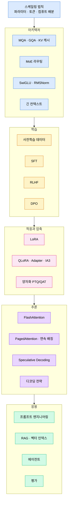

# Part 10 · LLM Engineering

## 이 파트의 목표

이 아카이브에서 가장 큰 파트다. LLM 엔지니어링은 단일 주제가 아니라 아키텍처, 학습, 압축, 추론, 응용 다섯 층이 겹쳐 있는 영역이고, 각 층에서 내리는 결정이 다른 층의 예산을 잡아먹는다. GQA를 쓰면 KV 캐시가 줄어 배치 크기를 키울 수 있고, 배치 크기가 커지면 처리량이 오르는 대신 첫 토큰 지연이 늘어난다. 이런 연쇄를 숫자로 계산할 수 있게 만드는 것이 목표다.

Part 08의 Transformer 구현을 전제로 시작한다. 어텐션의 형상 변화가 손에 익지 않았다면 먼저 그쪽을 마친다.

## 다섯 층

## 역할별 진입 경로

전부 순서대로 읽는 것이 정석이지만, 당장 필요한 작업이 있다면 아래 경로로 들어간다.

파인튜닝을 맡았다면 07(SFT) → 10(LoRA) → 11(QLoRA) → 12(양자화) → 22(평가) 순으로 읽는다.

추론 서빙을 맡았다면 02(KV 캐시) → 13(FlashAttention) → 14(PagedAttention과 배칭) → 15(Speculative) → 16(디코딩) 순이다. Part 13의 메모리 계산 문서를 함께 본다.

RAG 시스템을 맡았다면 17(프롬프트) → 18(RAG 파이프라인) → 19(벡터 인덱스) → 20(평가) 순이다.

정렬 학습을 맡았다면 07 → 08(RLHF) → 09(DPO) 순으로 읽는다.

## 자주 필요한 계산

| 계산 | 공식 |
| --- | --- |
| KV 캐시 크기 | $2 \times L_{seq} \times n_{layer} \times n_{kv} \times d_h \times \text{bytes}$ |
| 학습 메모리(AdamW, FP32 상태) | 파라미터 $4P$ + 그래디언트 $4P$ + 옵티마이저 $8P$ = $16P$ 바이트 |
| 추론 가중치 메모리 | $P \times \text{bytes per weight}$ |
| 학습 FLOPs 근사 | $6 \times P \times D$ ($D$는 학습 토큰 수) |
| 추론 FLOPs 근사 | 토큰당 $2P$ |
| Chinchilla 최적 비율 | $D \approx 20P$ |

각 공식의 유도와 실제 모델 크기 대입 예시는 해당 문서에서 다룬다.
