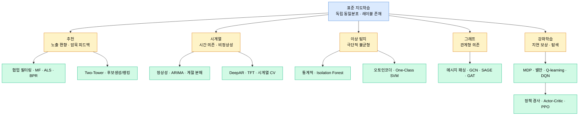

# Part 11 · Other Domains

## 이 파트의 목표

앞의 파트들이 다루지 않은 문제 구조를 모았다. 추천, 시계열, 이상 탐지, 그래프, 강화학습은 각각 독립된 분야지만 공통점이 있다. 표준 지도학습의 가정이 깨지는 지점에서 출발한다는 점이다.

추천은 관측된 상호작용이 사용자 선택에 의해 편향되어 있고, 시계열은 샘플이 독립이 아니며, 이상 탐지는 양성 레이블이 거의 없고, 그래프는 샘플 간 의존이 명시적이며, 강화학습은 정답 레이블 자체가 없다. 각 문서는 이 가정 붕괴를 먼저 짚고 시작한다.

## 문제 구조 대조

## 읽는 순서

문서 간 의존이 거의 없다. 필요한 것부터 읽는다. 다만 강화학습 두 편(05, 06)은 순서를 지킨다. 정책 경사 유도는 벨만 방정식과 가치 함수 정의를 전제한다.

Part 10의 RLHF 문서는 06번의 PPO를 전제로 하므로, 정렬 학습을 다룰 계획이라면 05~06을 먼저 읽는 편이 낫다.

## 각 도메인의 첫 번째 함정

| 도메인 | 가장 흔한 실수 |
| --- | --- |
| 추천 | 무작위 분할로 평가해 미래 정보가 학습에 새는 것 |
| 시계열 | 표준 K-fold 사용, 차분 없이 비정상 시계열에 회귀 적합 |
| 이상 탐지 | 정확도로 평가, 실제로는 PR-AUC와 비용 기반 임계값이 필요 |
| 그래프 | 전이적 설정과 귀납적 설정을 혼동해 실서비스에서 신규 노드 처리 불가 |
| 강화학습 | 보상 설계 오류로 의도하지 않은 행동을 최적화 |
