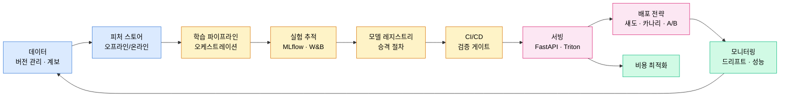

# Part 12 · MLOps and Production

## 이 파트의 목표

모델 성능이 올라가도 서비스 지표가 움직이지 않는 경우의 원인은 대개 모델 밖에 있다. 학습과 서빙의 특징 계산 방식이 다르거나, 재현 불가능한 실험을 근거로 배포했거나, 드리프트를 탐지하지 못해 조용히 성능이 새고 있거나, 롤백 경로가 없어 문제를 알고도 되돌리지 못하는 경우다.

이 파트는 그 경로를 하나씩 막는다. 도구 사용법을 나열하지 않고, 각 도구가 존재하는 이유가 되는 실패 모드를 먼저 서술한다.

## 생애주기

순환 구조라는 점이 중요하다. 모니터링에서 나온 신호가 데이터 수집으로 되돌아가지 않으면 시스템은 시간이 지날수록 나빠지기만 한다.

## 성숙도 단계

조직 상황에 따라 어디부터 손댈지 다르다. 아래 순서로 올린다.

레벨 0은 노트북에서 학습하고 수동으로 파일을 복사해 배포하는 상태다. 여기서 가장 먼저 할 일은 실험 추적(01)과 시드 고정이다. 도입 비용이 가장 낮고 회수가 가장 크다.

레벨 1은 학습 스크립트가 버전 관리되고 실험이 기록되는 상태다. 다음은 데이터 버전 관리(02)와 모델 레지스트리(05)다.

레벨 2는 파이프라인이 자동 실행되는 상태다. CI/CD 검증 게이트(09)와 배포 전략(11)을 붙인다.

레벨 3은 모니터링 신호로 재학습이 트리거되는 상태다. 드리프트 탐지(10)가 신뢰할 수준이어야 가능하다.

## 배포 전 체크리스트

| 항목 | 확인 내용 |
| --- | --- |
| 재현성 | 같은 커밋과 데이터 버전으로 지표가 재현되는가 |
| 학습-서빙 일관성 | 동일 입력에 대해 학습 시 특징과 서빙 시 특징이 일치하는가 |
| 성능 게이트 | 기준 모델 대비 회귀가 없는가, 슬라이스별로도 확인했는가 |
| 지연 예산 | p50뿐 아니라 p99가 SLA 안에 들어오는가 |
| 롤백 | 이전 버전으로 5분 내 되돌릴 수 있는가 |
| 모니터링 | 입력 분포와 예측 분포 대시보드가 배포 전에 준비되었는가 |
| 비용 | 예상 QPS에서 시간당 비용이 계산되어 있는가 |
