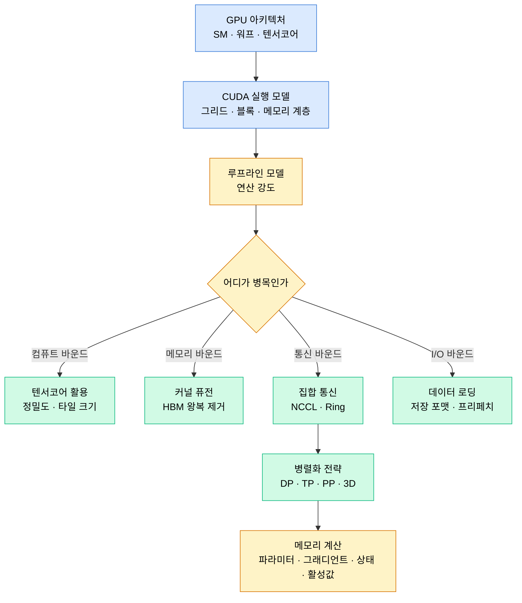

# Part 13 · Systems and Hardware

## 이 파트의 목표

"모델이 느리다"는 진술은 정보가 없다. 컴퓨트 바운드인지 메모리 대역폭 바운드인지 통신 바운드인지 I/O 바운드인지에 따라 해야 할 일이 완전히 달라진다. 메모리 바운드 커널에 텐서코어를 더 잘 쓰게 만드는 최적화는 아무 효과가 없다.

이 파트는 그 구분을 계산으로 하는 방법을 다룬다. 루프라인 모델로 연산 강도를 계산하고, 통신량을 알고리즘별로 세고, 학습 메모리를 항목별로 분해한다. 결과적으로 "이 모델은 A100 한 장에 들어가는가", "8장으로 늘리면 몇 배 빨라지는가"에 숫자로 답할 수 있게 된다.

## 성능 결정 요인

## 학습 순서

01~02는 하드웨어와 실행 모델이다. 워프 단위 실행과 메모리 계층을 모르면 이후 논의가 추상적으로만 남는다.

03이 이 파트의 중심이다. 루프라인 모델은 다섯 줄짜리 개념이지만, 최적화 우선순위를 결정하는 도구로서는 가장 강력하다. 04의 커널 퓨전은 03의 직접적 응용이며 Part 10의 FlashAttention이 왜 빠른지를 설명한다.

05~06은 다중 GPU다. Part 05의 DDP와 FSDP 문서와 함께 읽는다.

07~08은 실전에서 가장 자주 문제가 되는 두 지점이다. 08의 메모리 계산은 OOM이 났을 때 무엇을 줄여야 하는지 판단하는 근거가 된다.

## 병목 판별 순서

측정 없이 최적화하지 않는다. 아래 순서로 좁힌다.

1. GPU 사용률을 본다. 지속적으로 낮으면 I/O 또는 CPU 전처리 병목이다. Part 05의 프로파일링 문서로 간다.
2. 사용률이 높으면 커널별 시간을 본다. 소수 커널이 지배하면 그 커널의 연산 강도를 계산한다.
3. 연산 강도가 하드웨어 균형점보다 낮으면 메모리 바운드다. 퓨전, 정밀도 축소, 레이아웃 변경을 검토한다.
4. 균형점보다 높은데 느리면 텐서코어를 못 쓰고 있을 가능성이 크다. 차원이 8 또는 16의 배수인지 확인한다.
5. 다중 GPU에서 확장이 선형에 못 미치면 통신 시간을 측정한다. 버킷 크기와 오버랩 여부를 본다.

| 하드웨어 | FP16/BF16 최대 연산 | HBM 대역폭 | 균형점(FLOP/byte) |
| --- | --- | --- | --- |
| A100 80GB | 약 312 TFLOPS | 약 2.0 TB/s | 약 156 |
| H100 SXM | 약 990 TFLOPS | 약 3.35 TB/s | 약 295 |
| L40S | 약 362 TFLOPS | 약 0.86 TB/s | 약 420 |

균형점보다 연산 강도가 낮은 연산은 무조건 메모리 바운드다. LayerNorm, 활성함수, 원소별 덧셈이 모두 여기 속하며, 그래서 퓨전 효과가 크다.
