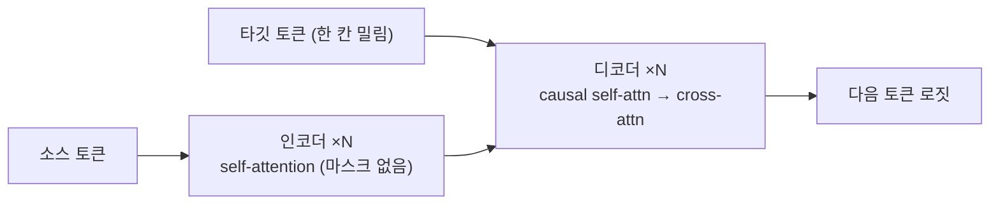

# 08. Transformer 밑바닥 구현

**만드는 것**: 인코더-디코더 Transformer 전체를 구현하고, "문자열 뒤집기" 시퀀스 변환 과제로 동작을 검증한다. 장난감 과제를 쓰는 이유: 데이터 준비에 시간을 쓰지 않고 아키텍처의 모든 부품(어텐션 3종, 마스킹 2종, 위치 인코딩)이 맞는지 몇 분 안에 확인할 수 있다.

**선행 지식**: [Scaled Dot-Product Attention](/handbook/08-sequence-nlp/06-scaled-dot-product-attention), [Transformer 블록과 마스킹](/handbook/08-sequence-nlp/09-transformer-block-and-masking), [핸드북의 전체 구현](/handbook/08-sequence-nlp/10-transformer-from-scratch)

## 구조 한눈에



어텐션은 세 번 등장하고 전부 같은 연산이다 — Q, K, V가 어디서 오는지만 다르다.

| 위치 | Q | K, V | 마스크 |
| --- | --- | --- | --- |
| 인코더 self-attn | 소스 | 소스 | 패딩 마스크 |
| 디코더 self-attn | 타깃 | 타깃 | 인과(causal) + 패딩 |
| 디코더 cross-attn | 타깃 | **인코더 출력** | 소스 패딩 마스크 |

## 전체 코드

```python
"""Encoder-Decoder Transformer — 문자열 뒤집기로 검증. 실행: python transformer.py"""
import math
import torch
import torch.nn as nn

device = "cuda" if torch.cuda.is_available() else "cpu"
PAD, BOS, EOS = 0, 1, 2      # 특수 토큰
VOCAB = 30                   # 특수 3 + 문자 27


class MHA(nn.Module):
    """Q, K, V의 출처를 분리한 어텐션 — cross-attention을 위해."""
    def __init__(self, d, h):
        super().__init__()
        self.h, self.dk = h, d // h
        self.wq, self.wk, self.wv, self.wo = (nn.Linear(d, d) for _ in range(4))

    def forward(self, q, k, v, mask=None):
        B, Lq, D = q.shape
        Lk = k.shape[1]
        q = self.wq(q).view(B, Lq, self.h, self.dk).transpose(1, 2)  # (B,h,Lq,dk)
        k = self.wk(k).view(B, Lk, self.h, self.dk).transpose(1, 2)
        v = self.wv(v).view(B, Lk, self.h, self.dk).transpose(1, 2)
        att = q @ k.transpose(-2, -1) / math.sqrt(self.dk)           # (B,h,Lq,Lk)
        if mask is not None:
            att = att.masked_fill(~mask, float("-inf"))              # True=보임
        y = att.softmax(-1) @ v
        return self.wo(y.transpose(1, 2).reshape(B, Lq, D))


class FFN(nn.Module):
    def __init__(self, d, mult=4):
        super().__init__()
        self.net = nn.Sequential(nn.Linear(d, mult * d), nn.GELU(), nn.Linear(mult * d, d))
    def forward(self, x):
        return self.net(x)


class EncoderLayer(nn.Module):
    def __init__(self, d, h):
        super().__init__()
        self.sa, self.ff = MHA(d, h), FFN(d)
        self.ln1, self.ln2 = nn.LayerNorm(d), nn.LayerNorm(d)
    def forward(self, x, src_mask):
        x = x + self.sa(self.ln1(x), self.ln1(x), self.ln1(x), src_mask)
        return x + self.ff(self.ln2(x))


class DecoderLayer(nn.Module):
    def __init__(self, d, h):
        super().__init__()
        self.sa, self.ca, self.ff = MHA(d, h), MHA(d, h), FFN(d)
        self.ln1, self.ln2, self.ln3 = (nn.LayerNorm(d) for _ in range(3))
    def forward(self, x, enc, tgt_mask, src_mask):
        x = x + self.sa(self.ln1(x), self.ln1(x), self.ln1(x), tgt_mask)   # 미래 차단
        x = x + self.ca(self.ln2(x), enc, enc, src_mask)                    # 소스 참조
        return x + self.ff(self.ln3(x))


def sinusoidal_pe(L, d):
    """사인 위치 인코딩 — 학습 파라미터 없이 위치를 표현한다."""
    pos = torch.arange(L).unsqueeze(1)
    div = torch.exp(torch.arange(0, d, 2) * (-math.log(10000.0) / d))
    pe = torch.zeros(L, d)
    pe[:, 0::2] = torch.sin(pos * div)
    pe[:, 1::2] = torch.cos(pos * div)
    return pe


class Transformer(nn.Module):
    def __init__(self, vocab=VOCAB, d=128, h=4, n_layers=2, max_len=64):
        super().__init__()
        self.emb = nn.Embedding(vocab, d, padding_idx=PAD)
        self.register_buffer("pe", sinusoidal_pe(max_len, d))
        self.encoder = nn.ModuleList([EncoderLayer(d, h) for _ in range(n_layers)])
        self.decoder = nn.ModuleList([DecoderLayer(d, h) for _ in range(n_layers)])
        self.ln_f = nn.LayerNorm(d)
        self.head = nn.Linear(d, vocab)

    def make_masks(self, src, tgt):
        # 패딩 마스크: (B, 1, 1, L) — 브로드캐스트로 모든 쿼리에 적용
        src_mask = (src != PAD)[:, None, None, :]
        tgt_pad = (tgt != PAD)[:, None, None, :]
        L = tgt.shape[1]
        causal = torch.tril(torch.ones(L, L, dtype=torch.bool, device=tgt.device))
        return src_mask, tgt_pad & causal                # (B,1,L,L)

    def forward(self, src, tgt):
        src_mask, tgt_mask = self.make_masks(src, tgt)
        e = self.emb(src) + self.pe[: src.shape[1]]
        for layer in self.encoder:
            e = layer(e, src_mask)
        d = self.emb(tgt) + self.pe[: tgt.shape[1]]
        for layer in self.decoder:
            d = layer(d, e, tgt_mask, src_mask)
        return self.head(self.ln_f(d))

    @torch.no_grad()
    def greedy_decode(self, src, max_len=32):
        self.eval()
        ys = torch.full((src.shape[0], 1), BOS, dtype=torch.long, device=src.device)
        for _ in range(max_len):
            logits = self(src, ys)[:, -1]                # 마지막 위치의 다음 토큰
            nxt = logits.argmax(-1, keepdim=True)
            ys = torch.cat([ys, nxt], dim=1)
            if (nxt == EOS).all():
                break
        return ys


# ---------- 장난감 데이터: 무작위 문자열 → 뒤집힌 문자열 ----------
def make_batch(B=64, min_len=5, max_len=20):
    src, tgt_in, tgt_out = [], [], []
    for _ in range(B):
        L = torch.randint(min_len, max_len + 1, (1,)).item()
        s = torch.randint(3, VOCAB, (L,))                # 특수 토큰 제외
        r = s.flip(0)
        pad = max_len - L
        src.append(torch.cat([s, torch.zeros(pad, dtype=torch.long)]))
        # teacher forcing: 디코더 입력은 [BOS, r], 정답은 [r, EOS]
        tgt_in.append(torch.cat([torch.tensor([BOS]), r, torch.zeros(pad, dtype=torch.long)]))
        tgt_out.append(torch.cat([r, torch.tensor([EOS]), torch.zeros(pad, dtype=torch.long)]))
    return (torch.stack(src).to(device), torch.stack(tgt_in).to(device),
            torch.stack(tgt_out).to(device))


def main():
    torch.manual_seed(0)
    model = Transformer().to(device)
    opt = torch.optim.AdamW(model.parameters(), lr=3e-4)
    crit = nn.CrossEntropyLoss(ignore_index=PAD)         # 패딩 위치는 손실 제외

    for step in range(2000):
        src, tgt_in, tgt_out = make_batch()
        logits = model(src, tgt_in)
        loss = crit(logits.reshape(-1, VOCAB), tgt_out.reshape(-1))
        opt.zero_grad(set_to_none=True); loss.backward(); opt.step()
        if (step + 1) % 200 == 0:
            src, _, tgt_out = make_batch(B=128)
            pred = model.greedy_decode(src)[:, 1:]       # BOS 제거
            L = min(pred.shape[1], tgt_out.shape[1])
            valid = tgt_out[:, :L] != PAD
            acc = ((pred[:, :L] == tgt_out[:, :L]) & valid).sum() / valid.sum()
            print(f"step {step+1:4d}  loss {loss.item():.4f}  token acc {acc:.4f}")
            model.train()


if __name__ == "__main__":
    main()
```

2000 스텝 안에 토큰 정확도가 99%+에 도달한다. 도달하지 못하면 마스크 어딘가가 틀린 것이다 — 이 장난감 과제의 존재 이유다.

## 반드시 이해할 세 지점

**1. Teacher forcing과 한 칸 밀림.** 학습 시 디코더 입력은 `[BOS, y1, ..., yn]`, 정답은 `[y1, ..., yn, EOS]`다. 각 위치가 "다음 토큰"을 예측하며, 인과 마스크 덕분에 모든 위치를 한 번의 순전파로 병렬 학습한다. 추론 시에는 이 병렬성이 없어 한 토큰씩 생성한다 — 학습과 추론의 비대칭이 LLM 서빙 문제의 근원이다.

**2. 마스크의 두 종류를 섞지 말 것.** 패딩 마스크는 "이 위치는 데이터가 아니다", 인과 마스크는 "미래는 못 본다"이다. 디코더 self-attention에는 둘의 AND가 필요하다. cross-attention에는 인과 마스크가 필요 없다 — 소스는 전부 주어진 정보다.

**3. $\sqrt{d_k}$ 스케일링.** 차원이 크면 내적의 분산이 커져 소프트맥스가 포화된다(그래디언트 소실). $\sqrt{d_k}$로 나눠 분산을 1로 유지하는 것 — 빼먹으면 이 장난감 과제조차 수렴이 눈에 띄게 느려진다. 직접 지워서 확인해 보라.

## 확장 과제

1. **복사 과제로 바꾸기** — 뒤집기 대신 그대로 복사하게 하면 더 빨리 수렴하는가? cross-attention 가중치를 시각화하면 대각선(뒤집기는 역대각선)이 보여야 한다.
2. **번역으로 확장** — Multi30k 등 소규모 병렬 코퍼스와 [07의 BPE](/practice/07-bpe-tokenizer)를 붙여 실제 번역기를 학습하라. BLEU 측정까지.
3. **`nn.Transformer`와 대조** — PyTorch 내장 구현으로 같은 과제를 풀고, 마스크 규약(`True`가 차단인 점이 반대다!)을 문서로 확인하라.

## 다음

디코더만 남기면 GPT다 → [09. GPT 밑바닥 구현과 학습](/practice/09-gpt-from-scratch)
