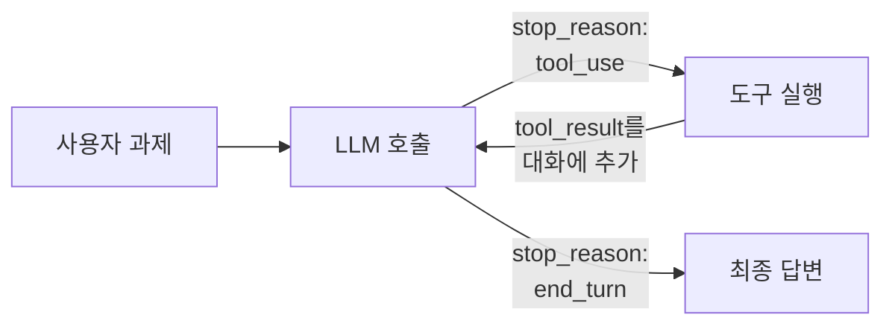

# 13. LLM 에이전트 밑바닥 구현

**만드는 것**: 도구(계산기, 파일 읽기, 검색)를 스스로 골라 쓰며 여러 단계에 걸쳐 과제를 수행하는 에이전트를, 프레임워크 없이 API 호출 루프로 직접 구현한다. LangChain 같은 프레임워크가 내부에서 하는 일이 정확히 이것이다 — 한 번 직접 짜 보면 프레임워크를 "이해하고" 쓸 수 있게 된다.

**선행 지식**: [에이전트형 인공지능](/curriculum/ch10/lecture20), [에이전트: 도구 사용과 실행 제어](/handbook/10-llm-engineering/21-agents)

## 에이전트 루프의 본질



에이전트 = **while 루프 하나**다. 모델이 도구를 요청하면 실행해 결과를 돌려주고, 더 이상 도구가 필요 없다고 할 때까지 반복한다.

## 전체 코드

```python
"""도구 쓰는 에이전트 — 프레임워크 없이 API 루프로.
의존성: pip install anthropic
환경변수: ANTHROPIC_API_KEY
실행: python agent.py "data/ 폴더의 CSV들을 읽고 매출 합계를 계산해줘"
"""
import json
import sys
from pathlib import Path

from anthropic import Anthropic

MODEL = "claude-opus-5"
MAX_TURNS = 15                      # 무한 루프 방지 — 에이전트의 기본 안전장치


# ---------- 1) 도구 구현: 그냥 파이썬 함수다 ----------
def calculator(expression: str) -> str:
    """안전한 산술 평가. eval을 그대로 쓰면 안 된다 — 코드 실행 구멍이 된다."""
    import ast, operator as op
    ops = {ast.Add: op.add, ast.Sub: op.sub, ast.Mult: op.mul,
           ast.Div: op.truediv, ast.Pow: op.pow, ast.USub: op.neg}

    def ev(node):
        if isinstance(node, ast.Constant):
            return node.value
        if isinstance(node, ast.BinOp):
            return ops[type(node.op)](ev(node.left), ev(node.right))
        if isinstance(node, ast.UnaryOp):
            return ops[type(node.op)](ev(node.operand))
        raise ValueError(f"허용되지 않는 표현식: {ast.dump(node)}")

    return str(ev(ast.parse(expression, mode="eval").body))


def read_file(path: str) -> str:
    """샌드박스: 작업 디렉토리 바깥은 읽지 못하게 막는다."""
    p = Path(path).resolve()
    if not p.is_relative_to(Path.cwd().resolve()):
        return "오류: 작업 디렉토리 밖의 파일은 읽을 수 없습니다."
    if not p.exists():
        return f"오류: {path} 파일이 없습니다."
    text = p.read_text(encoding="utf-8", errors="replace")
    return text[:20000]              # 긴 파일로 컨텍스트가 터지는 것 방지


def list_files(directory: str = ".") -> str:
    p = Path(directory).resolve()
    if not p.is_relative_to(Path.cwd().resolve()):
        return "오류: 작업 디렉토리 밖은 조회할 수 없습니다."
    return "\n".join(str(f.relative_to(Path.cwd()))
                     for f in sorted(p.rglob("*")) if f.is_file()) or "(비어 있음)"


TOOL_FUNCTIONS = {"calculator": calculator, "read_file": read_file, "list_files": list_files}

# ---------- 2) 도구 스키마: 모델에게 보여줄 명세 ----------
# 설명이 곧 프롬프트다 — 언제 써야 하는지까지 적을수록 도구 선택이 정확해진다.
TOOLS = [
    {
        "name": "calculator",
        "description": "산술 계산이 필요할 때 사용한다. 사칙연산과 거듭제곱을 지원한다.",
        "input_schema": {
            "type": "object",
            "properties": {"expression": {"type": "string",
                                          "description": "예: (1200 + 340) * 1.1"}},
            "required": ["expression"],
        },
    },
    {
        "name": "read_file",
        "description": "작업 디렉토리 안의 텍스트/CSV 파일 내용을 읽는다.",
        "input_schema": {
            "type": "object",
            "properties": {"path": {"type": "string"}},
            "required": ["path"],
        },
    },
    {
        "name": "list_files",
        "description": "디렉토리의 파일 목록을 본다. 어떤 파일이 있는지 모를 때 먼저 사용한다.",
        "input_schema": {
            "type": "object",
            "properties": {"directory": {"type": "string", "description": "기본값 '.'"}},
            "required": [],
        },
    },
]

SYSTEM = """당신은 도구를 활용해 과제를 수행하는 어시스턴트입니다.
필요한 정보를 도구로 수집·계산한 뒤, 과정을 요약해 한국어로 최종 답변하세요.
파일이 어디 있는지 모르면 list_files부터 사용하세요."""


# ---------- 3) 에이전트 루프 ----------
def run_agent(task: str) -> str:
    client = Anthropic()
    messages = [{"role": "user", "content": task}]

    for turn in range(MAX_TURNS):
        resp = client.messages.create(
            model=MODEL, max_tokens=4096,
            system=SYSTEM, tools=TOOLS, messages=messages)

        # 모델의 응답(도구 요청 포함)을 대화 이력에 그대로 추가
        messages.append({"role": "assistant", "content": resp.content})

        if resp.stop_reason != "tool_use":
            return "".join(b.text for b in resp.content if b.type == "text")

        # 요청된 도구를 전부 실행 — 결과는 '하나의' user 메시지에 모아 반환한다
        results = []
        for block in resp.content:
            if block.type == "tool_use":
                fn = TOOL_FUNCTIONS[block.name]
                print(f"  [{turn}] {block.name}({json.dumps(block.input, ensure_ascii=False)})")
                try:
                    output = fn(**block.input)
                    results.append({"type": "tool_result",
                                    "tool_use_id": block.id, "content": output})
                except Exception as e:               # 실패도 모델에게 알린다 — 스스로 복구하게
                    results.append({"type": "tool_result", "tool_use_id": block.id,
                                    "content": f"도구 실행 오류: {e}", "is_error": True})
        messages.append({"role": "user", "content": results})

    return "최대 턴 수에 도달해 중단했습니다."


if __name__ == "__main__":
    task = sys.argv[1] if len(sys.argv) > 1 else "이 디렉토리에 어떤 파일이 있는지 요약해줘"
    print("\n=== 최종 답변 ===\n" + run_agent(task))
```

실행하면 모델이 `list_files → read_file → calculator` 순으로 스스로 계획해 호출하는 과정이 로그로 보인다.

## 설계 결정들 — 이것이 에이전트 엔지니어링이다

**도구 설명이 절반이다.** 모델이 도구를 잘못 고르면 대부분 스키마 `description`이 부실해서다. "무엇을 하는가"만이 아니라 "언제 써야 하는가"까지 적는다.

**실패를 숨기지 않는다.** 도구가 예외를 던지면 `is_error: true`로 모델에게 알린다. 모델은 오류 메시지를 읽고 경로를 고치거나 다른 방법을 시도한다 — 이 자기 복구가 에이전트의 힘이다.

**안전장치는 처음부터.** 이 짧은 코드에도 세 겹이 있다: 최대 턴 수(폭주 방지), 경로 샌드박스(디렉토리 탈출 방지), `eval` 대신 AST 화이트리스트(코드 주입 방지). 쓰기·삭제·외부 API처럼 되돌리기 어려운 도구에는 사람 승인 단계를 넣는다. ([실행 제어](/curriculum/ch10/lecture20))

**병렬 도구 요청.** 모델은 한 응답에 tool_use 블록 여러 개를 넣을 수 있다. 전부 실행해 **하나의 user 메시지**로 모아 돌려줘야 한다 — 나눠 보내면 모델이 병렬 요청을 학습적으로 회피하게 된다.

**컨텍스트는 자원이다.** `read_file`의 20000자 제한처럼, 도구 출력이 컨텍스트를 삼키지 않게 다듬는다. 긴 에이전트 세션에서는 오래된 도구 결과를 요약·삭제하는 컨텍스트 관리가 필요해진다.

참고: 이 수동 루프는 학습용으로 최고지만, 실무에서는 Anthropic SDK의 tool runner(`client.beta.messages.tool_runner`)가 이 루프를 대신 돌려 준다 — 원리는 위와 동일하다.

## 확장 과제

1. **RAG를 도구로** — [12의 검색기](/practice/12-rag-system)를 `search_docs` 도구로 등록하라. "필요할 때만 검색하는" agentic RAG가 된다. 항상 검색하는 방식과 무엇이 다른가?
2. **승인 게이트** — `write_file` 도구를 추가하되, 실행 전에 터미널에서 y/n 확인을 받게 하라.
3. **ReAct 로그 분석** — 시스템 프롬프트에 "도구 호출 전에 계획을 한 문장으로 말하라"를 추가하고, 도구 선택 정확도가 달라지는지 10개 과제로 비교하라.
4. **멀티 에이전트** — "리서처(검색 도구)"와 "라이터(도구 없음)" 두 에이전트를 만들고, 오케스트레이터가 리서처의 결과를 라이터에게 넘기는 구조를 짜 보라.

## 다음

이해를 넘어 창조로 — 데이터를 생성하는 모델 → [14. VAE와 GAN 구현](/practice/14-vae-gan)
