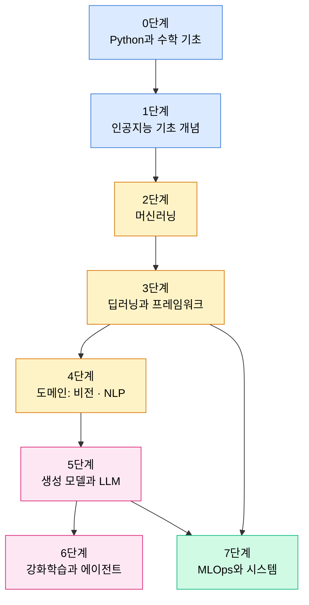

# 학습 로드맵

인공지능을 처음부터 실무 수준까지 공부하는 8단계 경로다. 각 단계는 **커리큘럼(개념)** 강의, **핸드북(이론·수식)** 문서, **[코드랩](/practice/)(실전 구현)** 을 짝지어 안내한다. 개념 → 수식 → 코드의 순서로 같은 주제를 세 번 통과하는 것이 이 로드맵의 설계다. 단계를 마칠 때마다 해당 [복습 퀴즈](/review/)로 점검한다.

## 전체 경로

## 0단계 — Python과 수학 기초

모든 것의 출발점이다. 코드를 읽고 쓸 수 있어야 하고, 수식이 두렵지 않아야 한다. 이미 익숙하다면 훑어보고 넘어가되, 역전파 유도(수학 파트 후반)는 반드시 손으로 따라가 본다.

| 무엇을 | 어디서 |
| --- | --- |
| Python 심화 문법과 NumPy/Pandas | [핸드북 Part 01 · Python Foundations](/handbook/01-python-foundations/) |
| 선형대수 — 벡터 공간, SVD | [핸드북 Part 02 · Mathematics](/handbook/02-mathematics/) 01~06편 |
| 미분 — 그래디언트, 연쇄법칙, 역전파 | [핸드북 Part 02](/handbook/02-mathematics/) 07~11편 |
| 확률과 최적화 | [핸드북 Part 02](/handbook/02-mathematics/) 12~18편, [Lecture 21~23](/curriculum/ch11/lecture21) |
| **코드랩** — 역전파를 손으로 | [01. NumPy로 신경망 밑바닥 구현](/practice/01-numpy-mlp-from-scratch) |

점검: [퀴즈 06. AI 수학](/review/quiz-math)

## 1단계 — 인공지능 기초 개념

"학습한다"는 것이 무엇인지 정의하는 단계다. 여기서 세운 관점(일반화, 편향-분산)이 이후 모든 단계의 기준이 된다.

| 무엇을 | 어디서 |
| --- | --- |
| 인공지능의 정의, AI→ML→DL | [Lecture 01](/curriculum/ch01/lecture01) |
| 학습의 개념과 패러다임 | [Lecture 02](/curriculum/ch01/lecture02), [Lecture 03](/curriculum/ch01/lecture03) |
| 일반화 문제 | [Lecture 04](/curriculum/ch02/lecture04) |
| 편향과 분산 | [Lecture 05](/curriculum/ch02/lecture05), [핸드북 Part 03 · 02편](/handbook/03-machine-learning/02-generalization-and-bias-variance) |

점검: [퀴즈 01. 인공지능 기초](/review/quiz-foundations)

## 2단계 — 머신러닝

경험적 위험 최소화라는 틀 위에서 전통적 ML 모델들을 이해한다. 테이블 데이터 실무의 기본기이자, 딥러닝을 이해하는 비교 기준이다.

| 무엇을 | 어디서 |
| --- | --- |
| 경험적 위험 최소화 | [Lecture 06](/curriculum/ch03/lecture06) |
| 전통적 ML 모델 개관 | [Lecture 07](/curriculum/ch03/lecture07) |
| 검증 설계와 평가지표 | [핸드북 Part 03](/handbook/03-machine-learning/) 03~04편 |
| 선형/로지스틱 회귀, 정규화, SVM, 트리 | [핸드북 Part 03](/handbook/03-machine-learning/) 05~13편 |
| 비지도 학습과 차원 축소 | [핸드북 Part 03](/handbook/03-machine-learning/) 14~15편 |
| **코드랩** — 파이프라인 감각 | [02. PyTorch 학습 파이프라인](/practice/02-pytorch-training-pipeline)의 검증·체크포인트 패턴 |

점검: [퀴즈 02. 머신러닝](/review/quiz-ml)

## 3단계 — 딥러닝과 프레임워크

신경망의 원리를 수식으로 이해하고, PyTorch로 직접 굴려 본다. 학습이 안 될 때의 진단 순서까지가 이 단계의 목표다.

| 무엇을 | 어디서 |
| --- | --- |
| 신경망의 원리와 표현 학습 | [Lecture 08](/curriculum/ch04/lecture08), [Lecture 09](/curriculum/ch04/lecture09) |
| 주요 신경망 구조 | [Lecture 10](/curriculum/ch04/lecture10) |
| MLP, 활성함수, 손실함수, 역전파 | [핸드북 Part 04 · Deep Learning](/handbook/04-deep-learning/) 01~04편 |
| 초기화, 정규화 계층, 드롭아웃, 잔차 | [핸드북 Part 04](/handbook/04-deep-learning/) 05~09편 |
| PyTorch 학습 루프와 분산 학습 | [핸드북 Part 05 · PyTorch](/handbook/05-pytorch/) |
| TensorFlow/Keras (선택) | [핸드북 Part 06 · TensorFlow](/handbook/06-tensorflow/) |
| **코드랩** — 밑바닥부터 실전까지 | [01. NumPy MLP](/practice/01-numpy-mlp-from-scratch) → [02. PyTorch 파이프라인](/practice/02-pytorch-training-pipeline) → [03. 전이학습](/practice/03-transfer-learning) |

점검: [퀴즈 03. 딥러닝](/review/quiz-dl)

## 4단계 — 도메인: 비전 · NLP

문제 영역별로 데이터 구조와 아키텍처가 어떻게 달라지는지 본다. Transformer는 여기서 완전히 이해하고 넘어가야 5단계가 편해진다.

| 무엇을 | 어디서 |
| --- | --- |
| 비전/언어/오디오 문제의 구조 | [Lecture 16](/curriculum/ch07/lecture16) |
| CNN에서 ViT까지 | [핸드북 Part 07 · Computer Vision](/handbook/07-computer-vision/) |
| 토큰화, RNN, 어텐션, Transformer | [핸드북 Part 08 · Sequence & NLP](/handbook/08-sequence-nlp/) |
| 추천/시계열/이상탐지/GNN (선택) | [핸드북 Part 11 · Other Domains](/handbook/11-other-domains/) |
| **코드랩** — 비전 | [04. U-Net](/practice/04-unet-segmentation) · [05. 객체 탐지](/practice/05-object-detection) · [06. ViT](/practice/06-vit-from-scratch) |
| **코드랩** — NLP | [07. BPE 토크나이저](/practice/07-bpe-tokenizer) · [08. Transformer](/practice/08-transformer-from-scratch) · [10. BERT 파인튜닝](/practice/10-bert-finetuning-hf) |
| **코드랩** — 오디오·멀티모달 | [19. 음성 인식](/practice/19-whisper-audio) · [18. CLIP](/practice/18-clip-multimodal) |

## 5단계 — 생성 모델과 LLM

생성이라는 문제 설정을 이해하고, VAE·GAN·확산 모델을 거쳐 LLM의 학습 파이프라인(사전학습→SFT→RLHF/DPO)과 서빙까지 내려간다.

| 무엇을 | 어디서 |
| --- | --- |
| 생성 모델의 관점과 접근법 | [Lecture 11](/curriculum/ch05/lecture11), [Lecture 12](/curriculum/ch05/lecture12) |
| VAE, GAN, Diffusion 수식 유도 | [핸드북 Part 09 · Generative Models](/handbook/09-generative-models/) |
| LLM의 본질, 스케일링, 정렬 | [Lecture 13](/curriculum/ch06/lecture13), [Lecture 14](/curriculum/ch06/lecture14), [Lecture 15](/curriculum/ch06/lecture15) |
| LoRA, 양자화, 서빙, RAG | [핸드북 Part 10 · LLM Engineering](/handbook/10-llm-engineering/) |
| LLM 기반 시스템 설계 | [Lecture 19](/curriculum/ch09/lecture19) |
| **코드랩** — 생성 모델 | [14. VAE·GAN](/practice/14-vae-gan) → [15. DDPM](/practice/15-ddpm-from-scratch) |
| **코드랩** — LLM | [09. GPT 밑바닥 구현](/practice/09-gpt-from-scratch) → [11. LoRA 파인튜닝](/practice/11-lora-finetuning) → [12. RAG](/practice/12-rag-system) |

점검: [퀴즈 04. 생성 모델과 LLM](/review/quiz-genai-llm), [퀴즈 08. LLM 엔지니어링 실무](/review/quiz-llm-engineering)

## 6단계 — 강화학습과 에이전트

보상으로부터 배우는 패러다임을 이해하고, LLM 에이전트로 연결한다. RLHF를 제대로 이해하려면 이 단계의 정책 경사가 필요하다.

| 무엇을 | 어디서 |
| --- | --- |
| 강화학습 기본 개념과 방법론 | [Lecture 17](/curriculum/ch08/lecture17), [Lecture 18](/curriculum/ch08/lecture18) |
| MDP, Q-learning, 정책 경사, PPO | [핸드북 Part 11](/handbook/11-other-domains/) 05~06편 |
| 에이전트형 인공지능 | [Lecture 20](/curriculum/ch10/lecture20), [핸드북 Part 10 · 21편](/handbook/10-llm-engineering/21-agents) |
| **코드랩** — RL | [16. DQN](/practice/16-dqn-cartpole) → [17. PPO](/practice/17-ppo-from-scratch) |
| **코드랩** — 에이전트 | [13. LLM 에이전트 밑바닥 구현](/practice/13-agent-from-scratch) |

점검: [퀴즈 05. 강화학습과 에이전트](/review/quiz-rl-agents)

## 7단계 — MLOps와 시스템

모델을 만드는 것과 운영하는 것은 다른 기술이다. 실험 추적부터 서빙, 모니터링, GPU 시스템까지 — 엔지니어로서의 마지막 조각이다.

| 무엇을 | 어디서 |
| --- | --- |
| 실험 추적, 파이프라인, 서빙, 드리프트 | [핸드북 Part 12 · MLOps](/handbook/12-mlops/) |
| GPU 아키텍처, 병렬화, 메모리 계산 | [핸드북 Part 13 · Systems & Hardware](/handbook/13-systems-hardware/) |
| 실무 습관과 디버깅 체크리스트 | [핸드북 Part 14 · Practitioner Guide](/handbook/14-practitioner-guide/) |
| CS 기초 (자료구조/OS/네트워크/DB) | [Lecture 24~28](/curriculum/ch12/lecture24) |
| **코드랩** — 서빙 | [20. 모델 서빙](/practice/20-serving-fastapi) |

점검: [퀴즈 09. MLOps와 시스템](/review/quiz-mlops-systems), [퀴즈 07. CS 기초](/review/quiz-cs)

## 이렇게 활용한다

1. **순차 학습** — 0단계부터 차례로. 각 단계에서 커리큘럼 강의를 먼저 읽고 핸드북 문서로 내려간다.
2. **문제 기반 진입** — 특정 주제가 필요할 때 위 표에서 해당 행만 찾아 들어간다. 검색(우측 상단)도 전체 문서를 커버한다.
3. **복습 사이클** — 단계를 마칠 때마다 퀴즈를 풀고, "다시 복습"으로 표시한 문항의 링크된 문서만 다시 읽는다.
